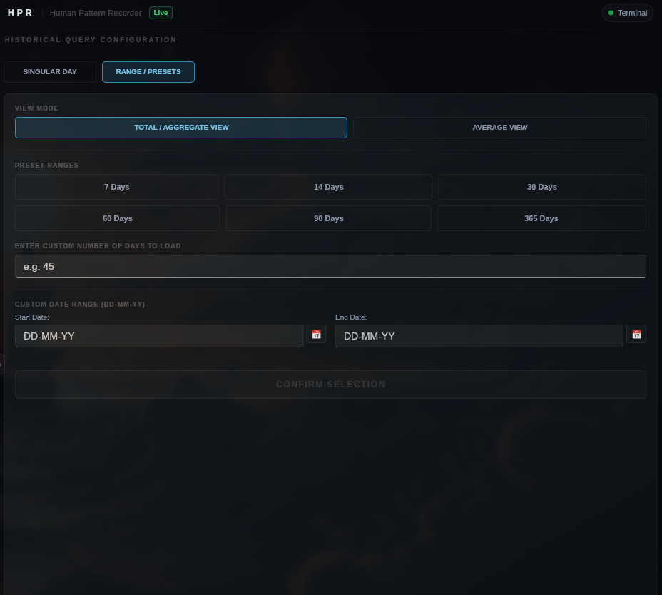

> [!NOTE]
> **HPR development is currently paused.**
>
> My only development machine has fully died — motherboard damage from years of electrical stress that progressively damaged the VRM and RAM. The repair costs 25k INR (~$300) which I can't afford right now. I'm a 16-year-old solo developer with no income. HPR is completely stalled until I can get the hardware situation resolved.
>
> A Rust rewrite (hpr-rs) was in progress before the machine died. The C++ codebase is stable and the last pushed version works, but no new features or bug fixes are possible until I have a working machine again.
>
> If HPR has been useful to you, a Ko-fi donation directly goes toward getting development back online. I'm not going to pretend otherwise.

<p align="center">
  <a href="https://ko-fi.com/plexescor">
    
  </a>
</p>

> HPR is built solo by a 16-year-old developer in India. My development laptop has fully died and I can't afford the repair. Every donation goes directly toward getting HPR back into active development.

<p align="center">
  
</p>

<h1 align="center">HPR &mdash; Human Pattern Recorder</h1>

<p align="center">
  
  
  
  
  
  
  
</p>

<p align="center">
  <strong>A compiled, offline, zero-account activity tracker.</strong><br/>
  Watches your active window. Builds your history. Never phones home.
</p>

---

<p align="center">
  <em>"HPR is an excellent tool for time management on Linux! It far outweighs any other option available and is developing very quickly! I highly recommend it!"</em><br/>
  <sub>— <a href="https://github.com/dotsupershow">@dotsupershow</a>, Niri user</sub>
</p>

---

> [!IMPORTANT]
> **HPR is fully free and open source.**
> Every feature — current and future — is available to everyone at no cost. If HPR saves you time or you want to support continued development, a Ko-fi donation goes a long way.

---

<p align="center">
  
</p>

---

<p align="center">
  
</p>

---

<p align="center">
  <strong>See HPR in action</strong><br/>
  <sub>Live window tracking, switch history, and the Insights engine — all running locally, zero accounts.</sub>
</p>

<p align="center">
  

https://github.com/user-attachments/assets/07659d3d-0f3b-4bbc-8823-8b5d11bfd32f


</p>

---

## Table of Contents

- [What It Does](#what-it-does)
- [What It Does Not Do](#what-it-does-not-do)
- [Browser Tab Tracking](#browser-tab-tracking)
- [VS Code Project Tracking](#vs-code-project-tracking)
- [App Limits and Goals](#app-limits-and-goals)
- [Day Construction Timeline](#day-construction-timeline)
- [Advanced Pattern Analysis](#advanced-pattern-analysis)
- [Extensions](#extensions)
- [System Tray](#system-tray)
- [Data Storage](#data-storage)
- [Installation](#installation)
- [Platform Support](#platform-support)
- [Performance](#performance)
- [Privacy](#privacy)
- [Comparison With Other Trackers](#comparison-with-other-trackers)
- [Aliases](#aliases)
- [Config](#config)
- [Customizing the UI](#customizing-the-ui-advanced)
- [Roadmap](#roadmap)
- [Architecture Overview](#architecture-overview)
- [Shared State and Synchronization](#shared-state-and-synchronization)
- [Event System](#event-system)
- [UI Bridging and Slint Interoperability](#ui-bridging-and-slint-interoperability)
- [Database Layer](#database-layer)
- [Timing Model](#timing-model)
- [Pattern Analysis Engine](#pattern-analysis-engine)
- [Window Name Normalization and Aliasing](#window-name-normalization-and-aliasing)
- [Class Lifecycle and Thread Management](#class-lifecycle-and-thread-management)
- [Building From Source](#building-from-source)
- [Adding a New Platform](#adding-a-new-platform)
- [Adding New Tracked Data](#adding-new-tracked-data)
- [Known Issues and Limitations](#known-issues-and-limitations)
- [Contributing](#contributing)

---

## What It Does

You open your computer. You work. Hours pass. You have no idea where they went.

HPR fixes that. It watches which window is in focus every 50 milliseconds, all day. It builds a running log of exactly where your time actually went — not where you think it went. Switch from your browser to your editor, it records the transition. Switch back two hours later, it records that too. Every switch. Every minute. Every day.

At any point you get three things live:

- **What you are in right now**, updating in real time
- **Total time per application today**, displayed as `2h 14m 30s`
- **Your complete switch history**: every transition, timestamped, in order

**Historical data — three modes:**

Click the calendar icon in the sidebar to open the History Range view:

| Mode | What it does |
|---|---|
| **Single Day** | Pick any specific date. Loads that day's `.db` file asynchronously off disk. |
| **Last N Days** | Pull last 7, 14, 30 days or any custom count. Multiple daily files are merged and aggregated. |
| **Date Range** | Set a start and end date. HPR reads every daily file in the span and streams the combined result back. |

Historical loading runs on a dedicated background thread — live tracking is never paused. A "Switch to Live View" button in the data view takes you back to real-time instantly.

<p align="center">
  
</p>

That is the whole pitch. A compiled binary that watches one thing and writes it down. Everything else is just what happens when you do that well.

**Tray controls:**

| Action | Windows | Linux (Waybar / KDE / Cinnamon) |
|---|---|---|
| Open HPR | Right click → **Show HPR** | Left or right click |
| Quit HPR | Right click → **Quit** | Middle click |
| Left click | Does nothing | Opens HPR |

> [!NOTE]
> On Linux, hovering over the tray icon shows **"HPR - Human Pattern Recorder"** as the tooltip title and **"Left/Right click: Open HPR \| Middle click: Quit"** as the description.

---

## Browser Tab Tracking

HPR supports tracking browser tabs per site and per tab without requiring any browser extensions. When the active window is a supported browser (Chrome, Edge, Firefox, or Brave), HPR automatically queries the window title alongside the application name. This tab usage time is aggregated and tracked separately, giving you a detailed breakdown of which websites and tabs you spend time on.

In the UI, toggle display mode with the **Tab View** and **Site View** buttons:
- **Tab View**: Shows raw, unaliased tab names — lets you differentiate between specific pages (e.g. two different YouTube videos).
- **Site View**: Applies rules from `tabAliases.csv` to group tabs by website, collapsing specific pages into parent domains.

---

## VS Code Project Tracking

HPR tracks which VS Code project you are in, not just that VS Code is open. No extension required. No VS Code plugin to install.

VS Code puts the active project name directly in its window title in the format `filename - project - Visual Studio Code`. HPR reads that title on every poll tick. When it detects VS Code is active, it parses the full title string:

1. Strip the trailing ` - Visual Studio Code` suffix
2. Find the last ` - ` separator in what remains
3. Everything after that separator is the project name

The result goes into `timeLog_PerProject`, a separate time accumulator running in parallel with the normal per-app log. The UI has a dedicated Project View showing time broken down by project name for the day. Toggle between **Raw View** (unprocessed title substring) and the default parsed view which applies `projectAliases.csv`.

This works on every supported platform — Hyprland, GNOME, KDE, Cinnamon, niri, and Windows — because each backend already has a window title getter and VS Code puts the project name in the title on all of them.

---

## App Limits and Goals

Set a daily time **limit** or daily usage **goal** on any tracked application — directly from the built-in Goals view in the sidebar.

**Limits** cap an app to a maximum number of minutes per day. When usage crosses that threshold:
1. HPR sends a system notification.
2. Optionally, HPR can **force-quit the application automatically**.

**Goals** set a minimum number of minutes you want to spend in an app each day (e.g. 30 minutes in your code editor). HPR tracks progress and notifies you when you hit it.

**How to configure:**
1. Click the Goals icon in the sidebar — every tracked app appears in the list automatically.
2. Click any app row to expand it inline — a minute input with +/− step buttons appears alongside three actions: **SET LIMIT**, **SET GOAL**, **RESET**.
3. Done. A dedicated background thread (`LimitsManager`) monitors usage continuously. No restart required.

Badges on each row show **remaining time live**. Limit rows have a red accent; goal rows have green.

<p align="center">
  
</p>

> [!NOTE]
> Advanced users can intercept the limit-reached event via the [Function Overriding API](https://hpr-cpp.netlify.app/overrides.html) to run custom Lua logic — log it, send a webhook, suppress the notification, or anything else.

---

## Day Construction Timeline

Rebuild your daily narrative with a visual, contiguous timeline of your system activity. Instead of just looking at raw accumulated numbers, the **Day Construction Timeline** maps your active window transitions chronologically onto a zoomable, scrollable canvas.

<p align="center">
  
</p>

### Key Timeline Features:
- **Scrollable & Zoomable Viewports**: Focus on specific intervals or view the entire day. Click presets to zoom in to `1h`, `3h`, or `8h` views, or zoom out to `24h` and `All Day` views.
- **Adaptive Hour Markers**: Timeline axis markers dynamically calculate and adjust. For zoomed modes (`1h`, `3h`, `8h`), they place markers at every 1-hour interval. For high-span modes (`24h` and `All Day`), they space markers every 3 hours (`00:00`, `03:00`, `06:00 AM/PM`, etc.) to prevent overlapping text and maintain an elegant, readable design.
- **Continuity Gap Capping**: If HPR is closed (e.g. you shutdown your PC or close HPR and reopen it 5 hours later), a naive timeline would stretch the last active app across the entire 5-hour gap. HPR's timeline reconstruction engine detects focus gaps and transitions to `Unknown`/system downtime, capping the last active application segment to a maximum of **1 minute** duration to keep your logs accurate.
- **Live HPR Tracking**: The tracking engine includes HPR itself as a tracked application, giving you visibility into the time you spend customizing goals, reviewing patterns, or managing extensions.
- **Hover Micro-interactions**: Hover your cursor over any timeline block to view its details instantly. The status panel updates dynamically with the application's aliased name, exact active duration, and start/end time range, removing the need for manual clicks.

---

## Advanced Pattern Analysis

Go beyond basic daily statistics with HPR's multi-day correlation engine. Under the **Insights** tab, HPR processes your historical database files to extract **9 advanced cross-day metrics** that help you understand your work habits, distractions, and focus zones over time:

1. **Escape Pattern**: Calculates the average number of times you switch directly from a primary work application (e.g., VS Code) to distraction/browser apps per day.
2. **Return Rate**: Computes the percentage of times you immediately bounce back to your work application after a browser escape, measuring your distraction recovery resilience.
3. **Average Focus Session**: Analyzes your timeline to determine the average duration of uninterrupted focus stretches before switching windows.
4. **Most Distracted Day**: Aggregates switches across all logged days to pinpoint the day of the week with the highest average multitasking frequency.
5. **Productive Days**: Tracks the number of days during the current week where your hourly switch frequency remained below the focus threshold.
6. **Screen Time vs Average**: Compares today's cumulative screen time against your N-day historical average to show whether you are overworking or taking it easy.
7. **Focus Dip Hour**: Identifies the specific hour of the day where your application switches spike most consistently, identifying your daily energy crashes.
8. **Deep Work Before Noon**: The percentage of days where your longest uninterrupted focus session kicks off in the morning (before 12:00 PM local time).
9. **Weekend vs Weekday**: Measures the percentage difference in work-app usage between weekdays and weekends, showing how well you separate work from leisure.

---

## Extensions

HPR ships with a built-in **Sandboxed Lua 5.4 Extension Engine**. Designed to be **beginner-friendly and approachable**, you can get started instantly — just drop a `.lua` file into your extensions folder and HPR loads it automatically on the next launch. No compilers, no package managers, no boilerplate, and no restart required after placing the file.

Each extension runs in its own isolated VM on a dedicated background thread, completely decoupled from the main tracking and rendering pipelines. A slow or misbehaving extension cannot block HPR's core loop or freeze the UI.

**What you can do with extensions:**
- Read the currently active window in real time (beginner-friendly!)
- Run shell commands and query the HPR database directly
- Register fully custom window detection backends for compositors HPR doesn't natively support
- Subscribe to HPR's internal event bus and react to state changes
- Build interactive custom UI panels that render inside HPR via Slint callback bindings
- **Function Overriding (Advanced)**: Intercept, block, or modify 26+ core C++ functions directly from Lua (e.g., intercepting window validation, customizing how active windows are processed, blocking notifications, etc.)
- AND MUCH MORE INSANE STUFF like impersonating ActivtyWatch client to feed the received data into HPR

<p align="center">
  
</p>

**Where to put your extensions:**

```
Linux:   ~/.config/HPR/extensions/
Windows: %APPDATA%\HPR\HPR_Config\extensions\
```

HPR scans recursively, so subdirectory organization like `extensions/my-backend/sway.lua` works fine.

**A minimal extension** — prints the active app every tick:
```lua
function onTick(delta)
    print(HPR.getCurrentWindow_E())
end
```

**Extension lifecycle hooks:**

| Hook | When it runs |
|---|---|
| `init()` | Once on load. Return an integer to set tick interval in ms (default 1000). |
| `onTick(delta)` | Periodically on the extension's thread. `delta` is actual elapsed ms since last tick. |
| `onExit()` | Once on shutdown. Must complete within **200ms** or HPR force-detaches the thread. |

**Documentation:**

| Guide | Link |
|---|---|
| QuickStart + Common Mistakes | [hpr-cpp.netlify.app/quickstart.html](https://hpr-cpp.netlify.app/quickstart.html) |
| Function Overriding API | [hpr-cpp.netlify.app/overrides.html](https://hpr-cpp.netlify.app/overrides.html) |
| Building a Custom Window Backend | [hpr-cpp.netlify.app/custom-app-extension.html](https://hpr-cpp.netlify.app/custom-app-extension.html) |
| EventHub & Extension Communication | [hpr-cpp.netlify.app/comm-bw-extension.html](https://hpr-cpp.netlify.app/comm-bw-extension.html) |
| Full API Reference | [hpr-cpp.netlify.app/api.html](https://hpr-cpp.netlify.app/api.html) |

---

## What It Does Not Do

> [!CAUTION]
> If you are looking for a keylogger, a screenshot tool, or anything that reads the contents of your windows, this is not it and never will be.

HPR reads exactly one thing from your system:

**`the title of the currently focused window`**

No keystrokes. No mouse movement. No screen capture. No clipboard. No file scanning. One string, every 50ms, written locally.

HPR is also not an Electron app, not a web server, not a Python daemon, not a subscription service. It is a compiled C++23 binary. It starts in milliseconds.

---

## Data Storage

```
~/.local/share/HPR/HPR_DB/          (Linux)
%APPDATA%\HPR\HPR_DB\               (Windows)

    05-26/
        01-05-26.db
        02-05-26.db
        ...
```

One `.db` file per day. One folder per month. Standard SQLite3 that any viewer can open. Delete last month by deleting the folder. Inspect a specific Tuesday by opening it in DB Browser for SQLite. No export step. No proprietary format. No account required.

A normal day of use is 30 to 100 KB. A full year sits under 50 MB total.

---

## Installation

**Arch Linux (AUR)**
```bash
yay -S hpr
```

**Windows**

Download and run the setup executable. The Inno Setup installer automatically handles placing `aliases.csv`, `tabAliases.csv`, `config.csv`, and the `ui/` folder into your config directory. If you have already customized any of these files, the installer prompts before overwriting. It also drops the latest default UI into `ui-REFERENCEONLY/` every update so you always have a clean reference to diff against.

**Linux (Manual)**
```bash
chmod +x installHPRConfigAndUi.sh
./installHPRConfigAndUi.sh
./HPR
```

On first launch HPR automatically creates a desktop entry at `~/.local/share/applications/hpr.desktop`. This registers HPR with your desktop environment so it appears in your application launcher correctly. The entry is only written when missing or stale — HPR checks whether the `Exec=` and `Icon=` fields already point to the current binary, and only rewrites if they don't.

> [!NOTE]
> If you installed via the AUR, the system-wide desktop entry is already managed by the package. HPR detects this and skips the local entry entirely.

<details>
<summary>Where does everything go?</summary>

**Config**
```
Linux:   ~/.config/HPR/
Windows: %APPDATA%\HPR\HPR_Config\
```

**Data**
```
Linux:   ~/.local/share/HPR/HPR_DB/
Windows: %APPDATA%\HPR\HPR_DB\
```

</details>

---

## System Tray

HPR lives in your system tray and keeps running when you close the window. The only way to quit it is through the tray.

**Windows:**
- Left click → does nothing
- Right click → context menu with **Show HPR** and **Quit**
- Minimizing or closing the window hides it to tray, does not quit

**Linux (Waybar · KDE · Cinnamon):**

HPR registers as a `org.kde.StatusNotifierItem` on the session D-Bus — the same protocol Discord, Steam, and every other modern app uses. No libraries linked. No GTK. No Qt. Pure D-Bus over `libdbus-1`.

- Left or right click → open HPR (Waybar routes both to the same D-Bus method; this is a Waybar limitation)
- Middle click → quit HPR
- Hover → shows tooltip with hint text

Works with Waybar on Hyprland, KDE's system tray, and Cinnamon's panel out of the box.

---

## Platform Support

| Platform | Backend | Extra Setup |
|---|---|---|
| Hyprland (Wayland) | `hyprctl` IPC | None |
| GNOME (Wayland) | Custom GNOME Shell extension ([lol-another-window-extension](https://github.com/plexescor/lol-another-window-extension)) | One-time only — run the bundled install script, log out, log back in |
| KDE Plasma 6+ (Wayland / X11) | KWin D-Bus scripting | None |
| Cinnamon (X11 + Wayland) | `org.Cinnamon.Eval` D-Bus method | None |
| niri (Wayland) | `niri msg` IPC | None |
| Windows 10 / 11 | Win32 API | None |

<details>
<summary>GNOME setup walkthrough</summary>

On first launch HPR checks whether its GNOME extension is active. If it is not, it tells you directly. Run the bundled `installWindowCallsExtension.sh`, which installs [lol-another-window-extension](https://github.com/plexescor/lol-another-window-extension) — a custom shell extension built specifically for HPR. Because GNOME on Wayland cannot hot-reload shell extensions, you log out and back in once. Every subsequent launch is fully automatic.

</details>

<details>
<summary>Cinnamon details</summary>

Cinnamon exposes `org.Cinnamon.Eval` — a D-Bus method that evaluates JavaScript inside the live Cinnamon process. HPR uses this to query `global.display.focus_window` directly. Because this goes through Cinnamon's compositor internals rather than X11 display properties, it works identically on both X11 and the experimental Wayland session without any code branching.

</details>

---

## Performance

<details>
<summary><strong>Windows</strong></summary>

Around **8 MB RSS** in real use.

</details>

<details>
<summary><strong>Linux — read this before opening a memory issue</strong></summary>

BTOP++, htop, and similar tools will report approximately **47 MB**. That number is accurate but it is not the full picture.

HPR's actual private memory is around **22 MB**. The remaining ~25 MB is shared GPU library pages mapped into HPR's address space by the OS because Slint uses OpenGL for rendering. Mesa's Gallium driver loads `libLLVM` as a JIT for shader compilation — this happens even when shaders are cached. `libLLVM` is 60+ MB and its resident pages account for most of the overhead shown in process monitors.

These pages are physically shared across every GPU-accelerated process on your system. Your compositor has them. Your browser has them. The kernel is not loading duplicate copies. The proportional cost to HPR specifically is around **50 MB PSS**.

To verify yourself:
```bash
cat /proc/$(pgrep HPR)/status | grep -E "RssAnon|RssFile|VmRSS"
```

`RssAnon` is HPR's actual private footprint. `RssFile` is the shared library mapping.

To eliminate GPU overhead entirely:
```csv
hardware-acceleration,false
```

This switches Slint to a CPU software renderer. RSS drops to approximately **27 MB**. The UI is visually identical. The only cost is slightly higher CPU usage during redraws — for a tracker redrawing every 200, imperceptible.

</details>

<details>
<summary><strong>Cachegrind (15 second sample)</strong></summary>

```
L1 instruction miss rate:          0.20%
Last-level instruction miss rate:  0.01%
L1 data miss rate:                 2.6%
Last-level data miss rate:         0.2%
Overall last-level miss rate:      ~0.0%
```

The 2.6% L1 data miss rate is entirely inside Slint's font rendering pipeline. Not a single HPR code path appears in the profile.

</details>

<details>
<summary><strong>Callgrind (60 second sample)</strong></summary>

4.46 billion instructions over 60 seconds. HPR's own C++ backend did not appear in the top 15 hottest functions by instruction count. Everything in that list was Slint, FreeType, fontconfig, or parley doing text work. Background threads poll and sleep. The main thread runs the event loop.

</details>

**CPU usage during normal operation: 1 to 3% on modern hardware. Startup time: instant.**

---

## Privacy

```
No accounts.
No telemetry.
No analytics.
100% offline core.
```

**Let's be completely upfront:** Networking code (`WinHTTP` on Windows, `libcurl` on Linux) **is compiled into the HPR binary**. However, **HPR itself never makes network calls and never phones home.**

The networking libraries are bundled solely to power the Lua extension engine. By default HPR runs entirely offline. Only when you explicitly install or write a Lua extension that invokes `HPR.httpGet_E` will HPR touch the internet.

> [!WARNING]
> **Extension Security Warning:**
> Extensions have access to the networking API (`HPR.httpGet_E`) and can also read your focus databases (`HPR.dbQuery_E`) and active window titles (`HPR.getCurrentWindow_E`). A malicious script could read your window history and exfiltrate it. **Only install extensions you fully trust and have reviewed.**

---

## Comparison With Other Trackers

| Feature | HPR | ActivityWatch | RescueTime | Toggl |
|---|---|---|---|---|
| Binary size | ~5 MB | 200 MB+ | Cloud app | Cloud app |
| RAM (real footprint) | ~27 MB private / ~47 MB reported (Linux), ~13 MB (Windows) | 200 MB+ | N/A | N/A |
| Account required | No | No | Yes | Yes |
| Data leaves your machine | Never | Never | Yes | Yes |
| Automatic tracking | Yes | Yes | Yes | No |
| Native Wayland | Yes | Partial | N/A | N/A |
| System tray | Yes (native, no libs) | Yes | Yes | Yes |
| Browser tab tracking | Yes (built-in, no extension) | Optional extension | Required extension | Optional extension |
| VS Code project tracking | Yes (built-in, no extension) | Via plugin | No | No |
| Per-app limits & goals | Yes (with force-quit option) | No | Limits only (premium) | No |
| Multi-day historical queries | Yes (Range / Last N Days) | Web dashboard only | No | No |
| Lua extension engine | Yes | No | No | No |
| Embedded web server | No | Yes | No | No |
| Open source | Yes | Yes | No | No |
| Launch time | Instant | Several seconds | N/A | N/A |
| Free | Yes | Yes | Limited | Limited |

ActivityWatch is the most honest comparison. It is a mature, maintained project with a full web dashboard, browser extensions, a plugin ecosystem, and years of production use. HPR has none of that yet. What HPR has: a fraction of the memory footprint, native Wayland from day one, no Python runtime, no embedded web server, and a scriptable extension engine.

If you need something mature and battle-tested today, use ActivityWatch. If the architecture and footprint appeal to you and you can tolerate being early, HPR is worth following.

---

## Aliases

Raw window titles from the OS are inconsistent. `Visual Studio Code` on one machine, `code` on another, `code.exe` on Windows. HPR ships with an `aliases.csv` that collapses all of those into one label. For browser tabs, `tabAliases.csv` handles collapsing page titles into website names.

Adding your own is one line in a CSV: `raw substring,Display Name`. Lines starting with `#` are comments.

> [!TIP]
> Aliases hot-reload. Save the file and HPR picks it up within the next UI tick. No restart.

The raw OS string is always preserved in the database. Aliases apply only at display time — renaming an alias retroactively updates every historical entry for that application with zero migration work.

---

## Config

`config.csv` is intentionally small:

```csv
use-interpreter,false       # true = load UI from config dir at runtime instead of compiled-in UI
hardware-acceleration,true  # false = CPU renderer, eliminates GPU library overhead on Linux
kill-apps,true              # false = disable automatic termination of applications when daily limits are exceeded
kill-cooldown,2500          # minimum time interval (in milliseconds) between sequential application terminations
poll-interval,50            # window focus check frequency (in milliseconds)
db-flush-interval,10000     # how often window tracking totals are saved to disk (in milliseconds)
extension-shutdown-timeout,300 # wait time (in milliseconds) for Lua extensions to finish onExit before force exiting
extension-reload-timeout,450 # wait time (in milliseconds) for Lua extensions to finish on reload/unload before detaching
ui-update-interval,200         # tracking loop polling and UI update frequency (in milliseconds)
ui-insight-interval,1000     # interval to run the pattern analyzer and update insights on the UI (in milliseconds)
ui-error-duration,5000       # duration for which active errors are displayed on the UI (in milliseconds)
```

```
Linux:   ~/.config/HPR/config.csv
Windows: %APPDATA%\HPR\HPR_Config\config.csv
```

---

## Customizing the UI (Advanced)

> [!IMPORTANT]
> This section is for people who want to modify HPR's visual design without touching C++ or recompiling.

HPR's UI is written in [Slint](https://slint.dev/). By default it is compiled into the binary at build time. Enabling interpreted mode tells HPR to load `.slint` files from disk at runtime instead.

**Enable interpreted mode:**
```csv
use-interpreter,true
```

**Your UI files live at:**
```
Linux:   ~/.config/HPR/ui/app-window.slint
Windows: %APPDATA%\HPR\HPR_Config\ui\app-window.slint
```

> [!WARNING]
> **Do not rename structs, properties, or callbacks.** HPR's C++ backend references these by exact name. Renaming them breaks the connection silently and the UI stops updating. Read `READ_ME_BEFORE_MODIFYING_UI.txt` inside your `ui/` folder before touching anything.

`ui-REFERENCEONLY/` in your config directory always holds the unmodified defaults for the current version. If you break something, diff against it.

---

## Roadmap

The foundational work is mostly done: local-first tracking, privacy architecture, Insights engine, native Wayland support, extension engine, offline data ownership. What comes next is refinement — polish, stability, quality-of-life improvements, UI work.

HPR is completely free. If it is useful to you, consider supporting development on Ko-fi.

---

# For Developers and Power Users

---

## Architecture Overview

HPR is a multi-threaded C++23 application organized around a single shared state struct. Each loaded extension adds its own dedicated thread on top of the baseline HPR threads (window poller, UI bridge, database writer, limits monitor):

```
Main Thread          (Slint event loop)
  Window Poller      [50ms  tick  -  CurrentWindowManager]
  UI Bridge          [200ms tick  -  HPR / HPRInterpreter + UiModelManager]
  Database Writer    [10s   tick + event-driven  -  DatabaseManager]
  Limits Monitor     [background  -  LimitsManager]
  Extension Threads  [N threads, one per loaded extension  -  ExtensionManager]

Historical Loader: spawns ad-hoc thread on date selection → emits result via EventHub
```

**Main thread** is `main.cpp`. It instantiates `ConfigManager`, `DatabaseManager`, and `CurrentWindowManager`, picks either `HPR` or `HPRInterpreter` based on config, then enters the Slint event loop.

**Window poller** lives in `CurrentWindowManager::getCurrentWindow_Loop`. It calls the platform-specific window getter every 50ms, acquires `stateMutex`, and updates the current window name and accumulated time.

**UI bridge** is `HPR::trackingLoop` or `HPRInterpreter::trackingLoop`. It wakes every 200ms, reads application and tab state, and dispatches model updates to the Slint main thread using `UiModelManager` via `slint::invoke_from_event_loop`.

**Database writer** is `DatabaseManager::writeLoop`. It flushes to SQLite every 10 seconds and also responds to `LOAD_DATABASE_SINGULAR` events to load historical data asynchronously.

---

## Shared State and Synchronization

All mutable shared data lives in one place:

```cpp
namespace AppState {
    struct AppState {
        std::string currentWindow;
        std::string previousWindow;
        std::map<std::string, uint64_t> timeLog_PerApp;
        std::map<std::string, uint64_t> timeLog_PerTab;
        std::map<std::pair<std::string, std::string>, std::vector<uint64_t>> switchHistory;
    };
    extern AppState state;
    extern std::mutex stateMutex;
}
```

Instantiated exactly once in `appState.cpp`. Every thread that touches it acquires `stateMutex` via `std::lock_guard`. The locking strategy is deliberately coarse-grained: lock the whole struct, copy what you need, release immediately, do all work on the copy.

`timeLog_PerApp` and `timeLog_PerTab` accumulate raw millisecond durations. `switchHistory` keys on `std::pair<string, string>` (from, to) and stores a `vector<uint64_t>` of Unix millisecond timestamps for every recorded transition.

---

## Event System

The UI layer and database layer have no direct references to each other. They communicate through `EventHub`, a centralized in-process pub/sub bus with typed payloads.

```cpp
// Subscribe
EventHub::connect(Event::HISTORY_LOADED_SINGULAR, [this](EventData data) { ... });

// Publish
EventHub::emit(Event::LOAD_DATABASE_SINGULAR, DatabaseDate_Singular{requestedDate});

// Cleanup
EventHub::disconnect(Event::HISTORY_LOADED_SINGULAR, id);
```

`EventData` is a `std::variant`. Payloads are type-safe at the call site. Subscribers get an integer ID on connection and use it to unsubscribe in their destructor.

---

## UI Bridging and Slint Interoperability

Two execution modes, one abstraction layer:

| Mode | Class | Mechanism |
|---|---|---|
| Compiled | `HPR` | Slint generates C++ from `.slint` at build time. Maximum performance, smallest footprint. |
| Interpreted | `HPRInterpreter` | Slint loads `.slint` from the config directory at runtime. Modify the UI without rebuilding. |

`UiModelManager` abstracts the difference. All writes are dispatched to the main thread via `slint::invoke_from_event_loop` because Slint UI objects are not thread-safe.

Model sync uses a surgical in-place update rather than clearing and repopulating. Clearing the model causes layout panics during resize and maximize:

```cpp
auto syncModel = [](auto model, const auto& vec) {
    size_t existing = model->row_count();
    size_t incoming = vec.size();
    size_t overlap  = std::min(existing, incoming);
    for (size_t i = 0; i < overlap; ++i)
        model->set_row_data(i, vec[i]);
    while (model->row_count() > incoming)
        model->erase(model->row_count() - 1);
    for (size_t i = existing; i < incoming; ++i)
        model->push_back(vec[i]);
};
```

---

## Database Layer

`sqlite_modern_cpp` is a header-only C++ wrapper over SQLite3. SQLite3 is the official single-file amalgamation compiled directly into the binary. Zero external database dependencies.

**Write strategy per table:**

```
app_usage      UNIQUE on app name   →  INSERT OR REPLACE   →  one row per app, always current
switch_history UNIQUE on timestamp  →  INSERT OR IGNORE    →  dump full history every flush, SQLite drops duplicates
```

**Every connection opens with:**
```sql
PRAGMA journal_mode=WAL;
PRAGMA synchronous=NORMAL;
```

A passive WAL checkpoint runs after every write cycle. This was added after hitting real WAL corruption on Btrfs with LUKS encryption during development.

The writer sleeps in 100 intervals of 100ms rather than one 10-second block. HPR exits within 100ms of shutdown instead of hanging for a sleep to expire.

**Single-instance lock:**

| Platform | Mechanism | On crash |
|---|---|---|
| Windows | `CreateFileA` with `FILE_FLAG_DELETE_ON_CLOSE` | Lock file auto-deletes even if HPR crashes hard |
| Linux | `flock(LOCK_EX \| LOCK_NB)` | Kernel releases the lock automatically on process death |

---

## Timing Model

| Clock | Role |
|---|---|
| `std::chrono::steady_clock` | Duration measurement between poll ticks. Monotonic. Immune to NTP corrections, DST transitions, and manual clock changes. |
| `std::chrono::system_clock` | Recording switch timestamps for display only. Never used in arithmetic. |

Using `system_clock` for duration measurement is a classic bug that corrupts accumulated totals when NTP fires or DST changes mid-session. Measurement and display use different clocks on purpose.

All millisecond tracking accumulators and UI formatters use 64-bit integers (`uint64_t`) and floating-point types (`float` / `double` in Slint properties) to guarantee that the system will not experience overflow or lossy downcast issues even during extremely long tracking runs.

---

## Pattern Analysis Engine

`PatternAnalyzer` runs behind the Insights view, computing both real-time daily metrics and advanced cross-day trend analyses.

### Real-Time Daily Analysis (Patterns 1–7)
Every 30 seconds inside `trackingLoop`, the engine acquires `stateMutex`, clones the active tracking data, and performs 7 analysis passes on the copy to avoid locking the main rendering threads.

- **Patterns 1–5 (Direct Aggregations)**: Scans `timeLog_PerApp` and `switchHistory` to find the most-used application, total tracked time, total switches, and the most switched-away-from/switched-to applications.
- **Pattern 6 (Longest Focus Session)**: Uses a **Chronological Event-Matching Algorithm**. The raw `switchHistory` map is flattened into a unified event timeline of arrivals and departures, sorted globally by timestamp in $O(N \log N)$. One pass pairs each arrival with its next departure. Orphaned arrivals (from crashes, reboots, or force-quits) are discarded, preventing ghost sessions.
- **Pattern 7 (Peak Productive Hour)**: Uses a **Sliding Window Heuristic**. A window constrained between 60 and 90 minutes slides across the consolidated timestamp list. The window containing the lowest switch frequency (lowest transitions per minute) is identified as the peak focus block.

### Advanced Cross-Day Analysis (Multi-Day Engine)
When the user switches to the Insights view, HPR asynchronously queries the historical SQLite database via `DatabaseManager`, streaming multiple daily records into a structured `std::vector<DayData>` and passing it to the `PatternAnalyzer`.

#### Core Algorithms:
1. **Config-Driven App Auto-Detection**:
   If not explicitly set in `config.csv` (using `pattern-work-app` and `pattern-browser-app`), the engine scans all historical data, computing total duration per app. It automatically designates the highest-duration app categorized as `AppCategory::WORK` (e.g. IDEs like VS Code, CLion) as the primary work application, and the highest-duration app under `AppCategory::BROWSER` (e.g. Chrome, Firefox) as the primary browser.
2. **Escape Pattern & Return Rate**:
   The engine builds a chronological switch timeline for each day. It counts transitions from a `WORK` app directly to a `BROWSER` app to calculate the daily escape average. For the Return Rate, it analyzes the transition immediately following each browser escape; if the destination is a `WORK` app, it increments the return counter.
3. **Focus Dip Hour**:
   Builds hourly switch frequency buckets across all loaded days. By computing the mean switch count per hour slot (0–23) across the multi-day span, it isolates the hour block where multitasking and distraction spike most consistently.
4. **Deep Work Before Noon**:
   Runs the Chronological Event-Matching Algorithm on each day's switch history. It extracts the longest single focus session for each day, determines its local start time hour, and calculates the percentage of days where this peak session began before 12:00 PM local time.
5. **Weekend vs Weekday Habits**:
   Splits the loaded `DayData` based on calendar day-of-week (0=Sunday, 6=Saturday). It calculates the average time spent in the primary work app on weekdays versus weekends, computing the percentage difference to characterize the user's weekend habits.

---

## Window Name Normalization and Aliasing

`validateAndUpdateWindow_Cross` in `validateAndUpdateWindow.cpp` is the first normalization pass:

```cpp
if (windowName.contains("searchhost")
    || windowName.contains("plasmashell")
    || windowName.contains("js::")       // KWin JS runtime artifact during injection
    || windowName.contains("null")
    // ...
    )
    return "Unknown";
```

The `js::` filter is specifically for KDE. The KDE backend injects a JavaScript payload into KWin via `qdbus6` (or `qdbus-qt6` on Fedora — auto-detected at startup) on every tick, and during that injection KWin's own JS runtime briefly appears as the active window. Without this filter, strings like `js::kwin_tmp_1234` silently accumulate time in your log every poll cycle.

`AliasManager` runs an O(N) substring scan through alias rules the first time it sees a new window name, then caches the result in an `unordered_map` for O(1) on every subsequent lookup. File is hot-reloaded on change.

---

## Class Lifecycle and Thread Management

Every class that owns a background thread follows the same contract:

```
Constructor  →  allocate resources, do NOT start the thread
run()        →  spawn the thread
thread body  →  check std::atomic<bool> running each iteration
destructor   →  set running = false, join() if joinable()
```

Shutdown is always clean. The database writer finishes its current flush before the process exits.

---

## Building From Source

**Requirements:**
- CMake 3.21+
- GCC 13+, Clang 16+, or MSVC 2022+ with C++23 support
- Slint 1.16.1 (the install script handles this)
- Linux only: `jq`, `gdbus`, `libdbus-1-dev`, `libcurl4-openssl-dev` (or distro equivalents)
- Windows only: bundled `WinToast` compiles out-of-the-box, no external deps needed

```bash
git clone https://github.com/plexescor/HPR
cd HPR
```

**Linux — install Slint (choose one):**
```bash
# System-wide (requires sudo)
sudo ./installDependencies.sh

# User-local (no sudo)
./installDependencies.sh
```

**Windows:** run `installDependencies.bat`. Pulls Slint 1.16.1, `slint-lsp`, and `slint-viewer` from GitHub releases.

**Build:**
```bash
mkdir build && cd build

# If you ran the install script without sudo:
cmake .. -DCMAKE_PREFIX_PATH="$HOME/.local"

# If you ran with sudo:
cmake ..

cmake --build . --parallel 8
```

HPR uses slightly patched versions of `sol2`, `lua`, and `sqlite3` in `external/` to avoid compile errors under C++23 strict mode. Swapping them out for system-installed versions will likely cause warnings and linker issues. Use the bundled ones for a clean build. CMake copies `aliases.csv`, `config.csv`, `ui/`, `assets/`, and the install scripts next to the output binary automatically — a fresh build is immediately runnable from the build directory.

---

## Adding a New Platform

[Refer to HPR Docs](https://hpr-cpp.netlify.app/docs.html)

---

## Adding New Tracked Data

[Refer to HPR Docs](https://hpr-cpp.netlify.app/docs.html)

---

## Known Issues and Limitations

> [!WARNING]
> **GNOME without the extension:** If [lol-another-window-extension](https://github.com/plexescor/lol-another-window-extension) is absent, HPR sets its internal platform identifier to `GNOME_NO_EXTENSION` and returns an instruction string from the poll loop rather than a window name. It will not attempt to run the install script autonomously. That is intentional behavior, not a bug.

> [!NOTE]
> **Linux platform detection:** HPR reads `$XDG_CURRENT_DESKTOP` and matches substrings via `std::string::contains`. Non-standard desktop session variables or nested compositor configurations may not resolve correctly.

---

## Contributing

The full codebase is readable in one sitting if you go in this order:

```
main.cpp              →  startup, config loading, thread orchestration
appState.hpp          →  the shared data model, the center of everything
getCurrentWindow.cpp  →  platform-specific window polling per backend
databaseManager.cpp   →  persistence, lock file, midnight rollover, historical load
limitsManager.cpp     →  per-app usage limit and goal monitoring, force-quit, notification dispatch
extensionManager.cpp  →  Lua VM lifecycle, sol2 bindings, hot-reload, RAII subscription tracking
uiModelManager.cpp    →  how C++ state becomes Slint models in both UI modes
```

One rule for all new code: anything that touches shared state goes through `AppState::stateMutex`. Lock, copy, release, work on the copy.

No formal process. Open an issue or submit a pull request.

If HPR has been useful to you, a Ko-fi helps keep development going:

---

<p align="center">
  <sub>
    Active development &nbsp;|&nbsp; v0.9 &nbsp;|&nbsp;
    Hyprland · GNOME · KDE Plasma · Cinnamon · niri · Windows 10/11 &nbsp;|&nbsp;
    C++23 · Slint 1.16.1 · SQLite3 amalgamation · sqlite_modern_cpp · Lua 5.4 · sol2
  </sub>
</p>
