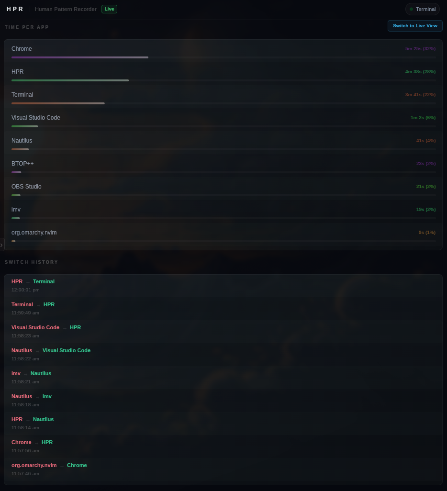
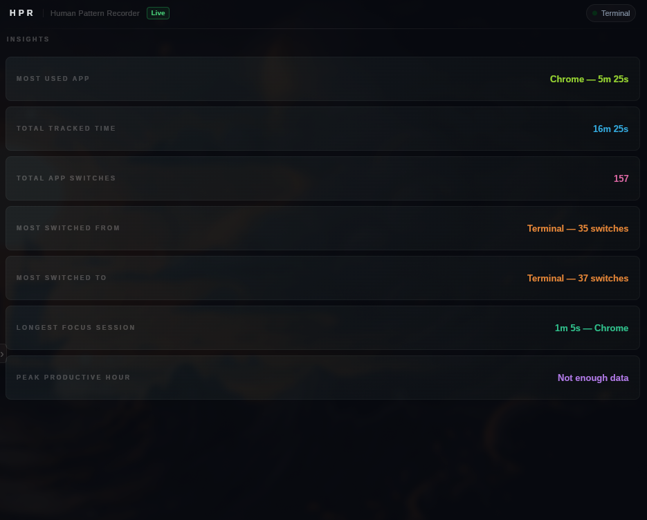
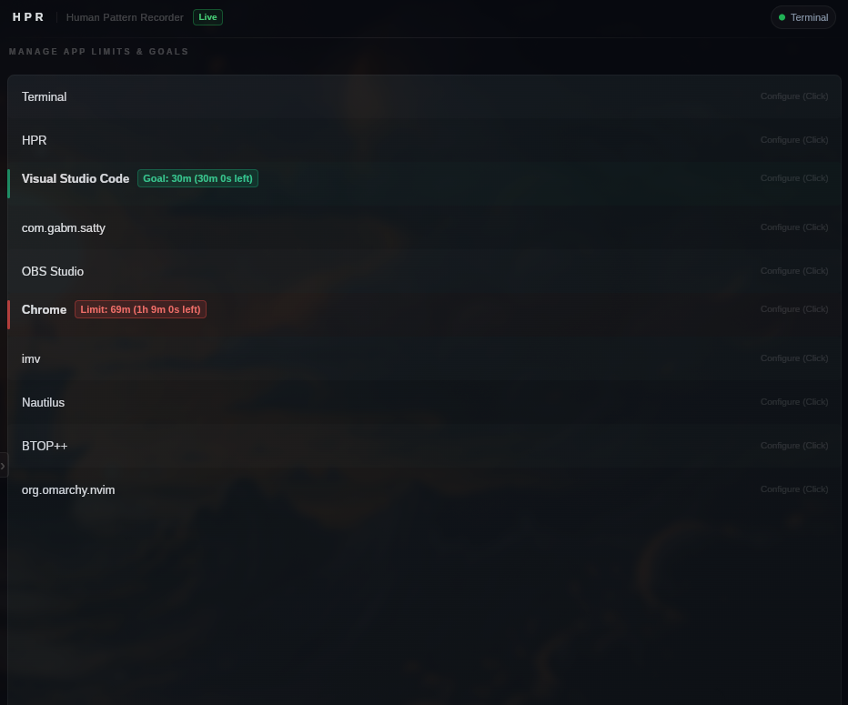
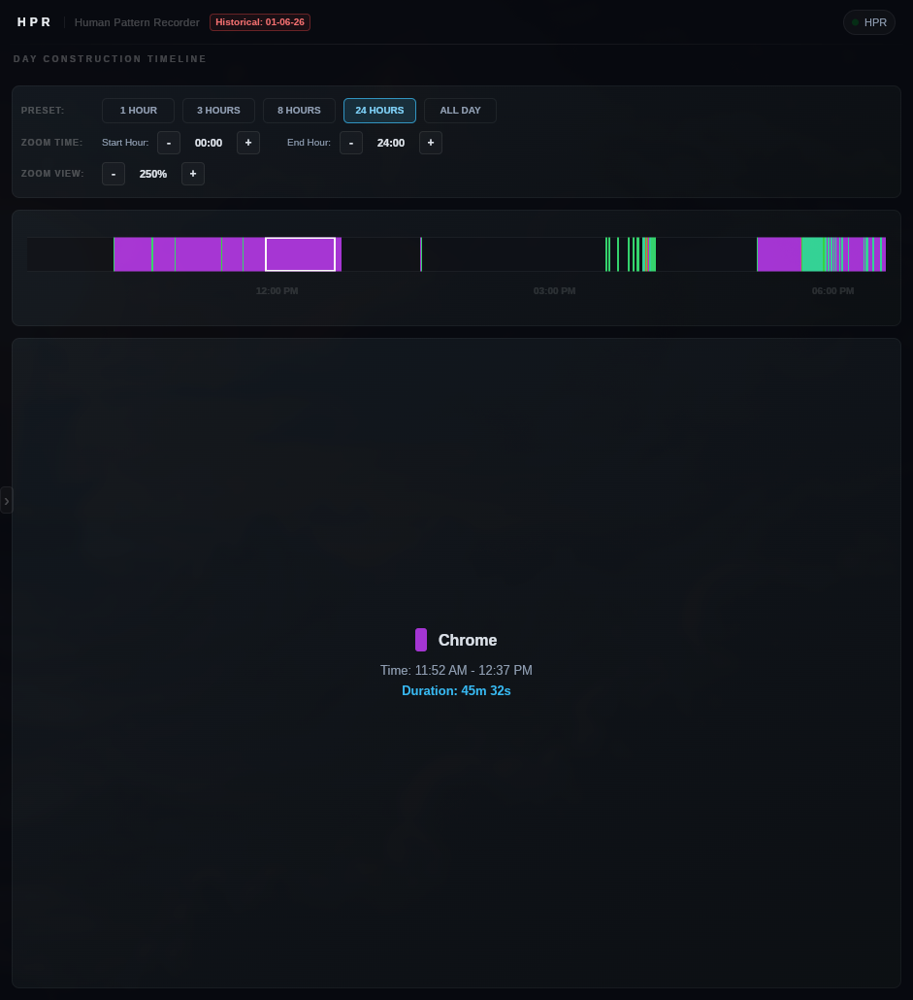
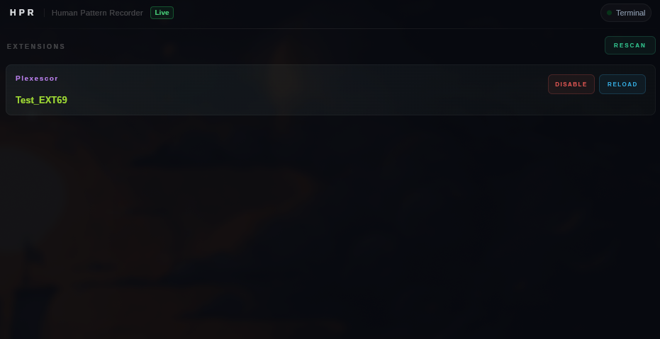

<p align="center">
  <a href="https://ko-fi.com/plexescor">
    
  </a>
</p>

> HPR is built solo by a 16-year-old developer in India. My Dad is pushing me to focus on JEE - India's national engineering entrance exam, one of the most brutally competitive exams in the world - so HPR development happens in whatever time I can steal from that. If I were an adult I would not have made HPR free at all because I would've needed money to survive, but I am a teen and I live under my Dad so I could "afford" HPR to be fully free and open source. If donations are enough to show this is worth continuing, I can justify spending time on HPR and try my hand at other things instead of just grinding JEE prep. If HPR has been useful to you, a Ko-fi donation genuinely helps.

---

## Sponsors & Supporters

A huge thank you to our supporters keeping HPR active!

- **[Jesse Kramer](https://ko-fi.com/jessekramer)** ($20) - *First Supporter* 💖

---

> **On Slint 1.17 and tray support:** I'm aware Slint 1.17 shipped with built-in tray icon support. I'm not upgrading to it. Slint's tray implementation doesn't work reliably across all platforms HPR targets - Waybar in particular has no usable support. Until Slint's tray story improves across the board, I'm keeping my native `libdbus-1` / Win32 approach which I know works everywhere HPR runs.

---

<p align="center">
  
</p>

<h1 align="center">HPR &mdash; Human Pattern Recorder</h1>

<p align="center">
  
  
  
  
  
  
  
</p>

<p align="center">
  <strong>A compiled, offline, zero-account activity tracker.</strong><br/>
  Watches your active window. Builds your history. Never phones home.
</p>

---

<p align="center">
  <em>"HPR is an excellent tool for time management on Linux! It far outweighs any other option available and is developing very quickly! I highly recommend it!"</em><br/>
  <sub>-- <a href="https://github.com/dotsupershow">@dotsupershow</a>, Niri user</sub>
</p>

---

> [!IMPORTANT]
> **HPR is fully free and open source.**
> Every feature - current and future - is available to everyone at no cost. If HPR saves you time or you want to support continued development, a Ko-fi donation goes a long way.

---

<p align="center">
  
</p>

---

<p align="center">
  
</p>

---

<p align="center">
  <strong>See HPR in action</strong><br/>
  <sub>Live window tracking, switch history, and the Insights engine - all running locally, zero accounts.</sub>
</p>

<p align="center">

https://github.com/user-attachments/assets/07659d3d-0f3b-4bbc-8823-8b5d11bfd32f

</p>

---

## Table of Contents

- [What It Does](#what-it-does)
- [Platform Support](#platform-support)
- [Comparison With Other Trackers](#comparison-with-other-trackers)
- [Installation](#installation)
- [Browser Tab Tracking](#browser-tab-tracking)
- [Code Editor & IDE Project Tracking](#code-editor--ide-project-tracking)
- [App Limits and Goals](#app-limits-and-goals)
- [Idle Tracking](#idle-tracking)
- [Day Construction Timeline](#day-construction-timeline)
- [Advanced Pattern Analysis](#advanced-pattern-analysis)
- [Theme Management](#theme-management)
- [Extensions](#extensions)
- [System Tray](#system-tray)
- [Data Storage](#data-storage)
- [Privacy](#privacy)
- [Aliases](#aliases)
- [Config](#config)
- [Customizing the UI](#custom-themes--customizing-the-ui-advanced)
- [Building From Source](#building-from-source)
- [Contributing](#contributing)

---

## What It Does

You open your computer. You work. Hours pass. You have no idea where they went.

HPR fixes that. It watches which window is in focus every 50 milliseconds, all day. It builds a running log of exactly where your time actually went - not where you think it went. Switch from your browser to your editor, it records the transition. Switch back two hours later, it records that too. Every switch. Every minute. Every day.

At any point you get three things live:

- **What you are in right now**, updating in real time
- **Total time per application today**, displayed as `2h 14m 30s`
- **Your complete switch history**: every transition, timestamped, in order


**Tray controls:**

| Action | Windows | Linux (Waybar / KDE / Cinnamon) |
|---|---|---|
| Open HPR | Right click > **Show HPR** | Left or right click |
| Quit HPR | Right click > **Quit** | Middle click |

> [!NOTE]
> On Linux, hovering over the tray icon shows **"HPR - Human Pattern Recorder"** as the tooltip title and **"Left/Right click: Open HPR | Middle click: Quit"** as the description.

---

## Platform Support

HPR features native, lightweight tracking backends for major Linux desktop environments, window managers, and Windows.

| OS | Desktop / WM | Session Type | Tracking Backend | Setup Required | Status |
|:---|:---|:---|:---|:---|:---|
| **Linux** | Hyprland | Wayland | `hyprctl` IPC | None | ✅ |
| **Linux** | GNOME | Wayland | Custom Shell Extension | Install Extension (Interactive prompt) | ✅ |
| **Linux** | KDE Plasma 6+ | Wayland / X11 | KWin D-Bus scripting | None | ✅ |
| **Linux** | Cinnamon | X11 / Wayland | `org.Cinnamon.Eval` D-Bus | None | ✅ |
| **Linux** | niri | Wayland | `niri msg` IPC | None | ✅ |
| **Windows** | Windows 10 / 11 | Native Desktop | Win32 API (`GetForegroundWindow`) | None | ✅ |

> [!NOTE]
> **GNOME Window Tracking:** On GNOME desktop environments, HPR requires the custom `lol-another-window-extension` to fetch active window titles. If you install HPR via the interactive Linux installer script, it will automatically prompt and install this extension for you. On GNOME Wayland, a session logout/login is required once to allow GNOME Shell to discover the newly cloned extension.

---

## Comparison With Other Trackers

A comparison between HPR and other popular automatic time trackers:

| Feature | **HPR** | **ActivityWatch** | **RescueTime** | **Toggl Track** |
| :--- | :--- | :--- | :--- | :--- |
| **Data Privacy** | 100% Offline / Local | Local (Self-hosted) | Cloud (Remote servers) | Cloud (Remote servers) |
| **Account Required** | **No** | **No** | Yes | Yes |
| **Telemetry / Tracking** | Opt-in telemetry only | None by default | Proprietary analytics | Proprietary analytics |
| **Executable Size** | **~5 MB** (Compiled C++) | 200 MB+ (Python/Rust/JS) | Cloud agent size varies | ~100 MB+ (Electron/Web wrapper) |
| **RAM Footprint** | **8 - 27 MB** (Extremely low) | 200 MB+ (High) | Moderate | High |
| **CPU Overhead** | **<3% during active tracking** | Moderate | Low | Low |
| **Tracking Autonomy** | Fully Automated | Fully Automated | Fully Automated | Primarily Manual (start/stop) |
| **Editor/Browser Detail** | Native (No extensions needed) | Requires watchers/plugins | Requires browser extension | Requires extensions/plugins |
| **Extensibility** | Embedded Lua VM engine | Custom Python/Rust watchers | Proprietary API | Web hooks / API integrations |
| **UI Customization** | Customizable Slint templates | Custom web dashboard CSS | None | None |
| **License / Cost** | Free & Open Source (GPL-3) | Free & Open Source | Closed source (Paid premium) | Closed source (Paid team tiers) |

---

## Installation

**Arch Linux (AUR)**
```bash
yay -S hpr
```

**Linux (Universal)**

You can install or update HPR on Linux automatically with a single command:
```bash
curl -fsSL https://raw.githubusercontent.com/plexescor/HPR/main/install.sh | bash
```
<details>
<summary>The interactive installation script performs the following actions:</summary>

<ul>
<li><strong>Dependency Verification</strong>: Checks for required CLI tools (<code>curl</code>, <code>tar</code>, <code>xz</code>, <code>dbus-send</code>, <code>git</code>).</li>
<li><strong>Re-installation Prevention</strong>: Before running a clean installation, the script verifies if HPR is already installed and warns you to use the update mode instead.</li>
<li><strong>Flexible Version Selection</strong>: Prompts you to select between installing the Latest release (automatically fetching and displaying the latest tag) or specifying a Custom version (e.g., <code>v0.9.3</code> or <code>0.9.3</code>, with input normalization to prepend <code>v</code> automatically if omitted).</li>
<li><strong>System Binary Installation</strong>: Prompts you for your preferred system-wide installation path (defaults to <code>/usr/local/bin/HPR</code>) and installs the binary (uses <code>sudo</code> for binary copy only).</li>
<li><strong>Configuration Setup</strong>: Creates the config directories (<code>~/.config/HPR</code> and <code>~/.local/share/HPR</code>) and writes the default CSV files if they do not exist.</li>
<li><strong>User Customization Protection</strong>: Detects if you have modified your CSV configuration files or the custom <code>ui/</code> folder, and preserves your changes. Only untouched default configuration files/folders are updated.</li>
<li><strong>Wipe Confirmation and Safe Abort</strong>: Before updating or removing HPR, prompts you for a directory wipe confirmation. If you choose to cancel, the entire process aborts immediately, keeping your files safe.</li>
<li><strong>GNOME Extension Installation</strong>: Detects if you are running the GNOME Desktop and prompts you to install the custom window-tracking extension (<code>lol-another-window-extension</code>) if it's missing.</li>
<li><strong>Launcher Creation</strong>: Configures high-resolution app icon paths, creates a desktop launcher entry (<code>~/.local/share/applications/hpr.desktop</code>), and refreshes application menu databases.</li>
</ul>

</details>

<!-- -->
---

> [!NOTE]
> If you installed via the AUR, the system-wide desktop entry is already managed by the package. HPR detects this and skips the local entry entirely.

**Windows**

Download and run the setup executable. The Inno Setup installer handles placing `aliases.csv`, `tabAliases.csv`, `config.csv`, and the `ui/` folder into your config directory. It also drops the latest default UI into `ui-REFERENCEONLY/` every update so you always have a clean reference to diff against.

<details>
<summary>Where does everything go?</summary>

**Config**
```
Linux:   ~/.config/HPR/
Windows: %APPDATA%\HPR\HPR_Config\
```

**Data**
```
Linux:   ~/.local/share/HPR/HPR_DB/
Windows: %APPDATA%\HPR\HPR_DB\
```

</details>

> [!NOTE]
> **Microsoft Visual C++ Runtime (64-bit)**
>
> HPR depends on the Microsoft Visual C++ Runtime. If you're using **Windows 10** or **Windows 11 which are installed fresh, install the **64-bit Microsoft Visual C++ Redistributable** before launching HPR.
>
> **Download (x64):** https://aka.ms/vc14/vc_redist.x64.exe

---

## Browser Tab Tracking

HPR supports tracking browser tabs per site and per tab without requiring any browser extensions. When the active window is a supported browser (Chrome, Edge, Firefox, Brave, or Zen Browser), HPR automatically queries the window title alongside the application name. This tab usage time is aggregated and tracked separately, giving you a detailed breakdown of which websites and tabs you spend time on.

### Browser Support Matrix

| Browser | Platform Support | Status &nbsp; &nbsp; &nbsp; &nbsp; &nbsp; &nbsp; | Extension Required | Parsing Strategy / Notes |
| :--- | :--- | :------------------- | :--- | :--- |
| **Google Chrome** | Windows / Linux | ✅ Working | No | Matches `chrome` (case-insensitive) in window title/process name |
| **Microsoft Edge** | Windows / Linux | ✅ Working | No | Matches `edge` (case-insensitive) in window title/process name |
| **Mozilla Firefox** | Windows / Linux | ✅ Working | No | Matches `firefox` (case-insensitive) in window title/process name |
| **Brave** | Windows / Linux | ✅ Working | No | Matches `brave` (case-insensitive) in window title/process name |
| **Zen Browser** | Windows / Linux | ✅ Working | No | Matches `zen` (case-insensitive) in window title/process name |

In the UI, toggle display mode with the **Tab View** and **Site View** buttons:
- **Tab View**: Shows raw, unaliased tab names - lets you differentiate between specific pages.
- **Site View**: Applies rules from `tabAliases.csv` to group tabs by website, collapsing specific pages into parent domains.

---

## Code Editor & IDE Project Tracking

HPR tracks which project you are currently working in, not just whether the editor is open. No editor extensions, plugins, or marketplace installs are required.

> [!NOTE]
> On Windows, HPR currently supports only 64-bit JetBrains IDEs. 32-bit builds are not supported.

### IDE & Code Editor Support Matrix

| Application | Platform Support | Status &nbsp; &nbsp; &nbsp; &nbsp; &nbsp; &nbsp; | Extension Required | Parsing Strategy / Notes |
| :--- | :--- | :------------------- | :--- | :--- |
| **Visual Studio Code** | Windows / Linux | ✅ Working | No | Matches `code`, `vscode`, or `visual studio code` (case-insensitive) in window title/process name |
| **IntelliJ IDEA** | Windows / Linux | ✅ Working | No | Matches `jetbrains` (case-insensitive) in window title/process name; extracts project name before the en dash (–). |
| **WebStorm** | Windows / Linux | ✅ Working | No | Matches `jetbrains` (case-insensitive) in window title/process name; extracts project name before the en dash (–). |
| **PyCharm** | Windows / Linux | ✅ Working | No | Matches `jetbrains` (case-insensitive) in window title/process name; extracts project name before the en dash (–). |
| **CLion** | Windows / Linux | ✅ Working | No | Matches `jetbrains` (case-insensitive) in window title/process name; extracts project name before the en dash (–). |
| **Rider** | Windows / Linux | ✅ Working | No | Matches `jetbrains` (case-insensitive) in window title/process name; extracts project name before the en dash (–). |
| **GoLand** | Windows / Linux | ✅ Working | No | Matches `jetbrains` (case-insensitive) in window title/process name; extracts project name before the en dash (–). |
| **RustRover** | Windows / Linux | ✅ Working | No | Matches `jetbrains` (case-insensitive) in window title/process name; extracts project name before the en dash (–). |
| **PhpStorm** | Windows / Linux | ✅ Working | No | Matches `jetbrains` (case-insensitive) in window title/process name; extracts project name before the en dash (–). |
| **RubyMine** | Windows / Linux | ✅ Working | No | Matches `jetbrains` (case-insensitive) in window title/process name; extracts project name before the en dash (–). |
| **DataGrip** | Windows / Linux | ✅ Working | No | Matches `jetbrains` (case-insensitive) in window title/process name; extracts project name before the en dash (–). |
| **DataSpell** | Linux | ✅ Working | No | Matches `jetbrains` (case-insensitive) in window title/process name; extracts project name before the en dash (–). |

### How It Works

#### Visual Studio Code
VS Code puts the active project name directly in its window title in the format `filename - project - Visual Studio Code`. HPR reads that title on every poll tick and parses it:
1. Strip the trailing ` - Visual Studio Code` suffix.
2. Find the last ` - ` separator in what remains.
3. Everything after that separator is the project name.

#### JetBrains IDEs (Beta)
HPR prepend `jetbrains: ` to the active project window title (resolving to `jetbrains: ProjectName – file [module]` or just `jetbrains: ProjectName` using an en dash `–`). HPR parses it:
1. Strip the `jetbrains: ` prefix.
2. Find the first occurrence of the en dash ` – ` (`\xe2\x80\x93`).
3. Everything before the en dash is the project name. If no en dash is found, the whole cleaned string is used.

The result goes into `timeLog_PerProject`, a separate time accumulator running in parallel with the normal per-app log. The UI has a dedicated Project View showing time broken down by project name for the day. Toggle between **Raw View** (unprocessed title substring) and the default parsed view which applies `projectAliases.csv`.

This works on every supported platform because each backend already has a window title getter, and the supported editors put the project name in the title.

---

## App Limits and Goals

Set a daily time **limit** or daily usage **goal** on any tracked application directly from the Goals view in the sidebar.

**Limits** cap an app to a maximum number of minutes per day. When usage crosses that threshold:
1. HPR sends a system notification.
2. Optionally, HPR can **force-quit the application automatically**.

**Goals** set a minimum number of minutes you want to spend in an app each day. HPR tracks progress and notifies you when you hit it.

**How to configure:**
1. Click the Goals icon in the sidebar - every tracked app appears automatically.
2. Click any app row to expand it inline - a minute input with +/- step buttons appears alongside three actions: **SET LIMIT**, **SET GOAL**, **RESET**.
3. Done. A dedicated background thread (`LimitsManager`) monitors usage continuously. No restart required.

Badges on each row show **remaining time live**. Limit rows have a red accent; goal rows have green.

<p align="center">
  
</p>

> [!NOTE]
> Advanced users can intercept the limit-reached function call via the [Function Overriding API](https://hpr-cpp.netlify.app/overrides.html) to run custom Lua logic - log it, send a webhook, suppress the notification, or anything else.

---

## Idle Tracking

HPR supports automatic **Idle Detection & Tracking** to pause or separate active time logging when you step away from your keyboard and mouse.

<p style="font-size: 1.15em;">
  Idle tracking is powered by the official <strong><a href="https://github.com/plexescor/HPR-Idle-Detection-Extension">HPR-Idle-Detection-Extension</a></strong>, available for instant 1-click download and installation directly from <strong><a href="https://github.com/plexescor/HPR-Store">HPR-Store</a></strong>!
</p>

---

## Day Construction Timeline

Rebuild your daily narrative with a visual, contiguous timeline of your system activity. Instead of just looking at raw accumulated numbers, the **Day Construction Timeline** maps your active window transitions chronologically onto a zoomable, scrollable canvas.

<p align="center">
  
</p>

**Key timeline features:**

- **Scrollable & Zoomable Viewports**: Focus on specific intervals or view the entire day. Click presets to zoom into `1h`, `3h`, or `8h` views, or zoom out to `24h` and `All Day` spans.
- **Adaptive Hour Markers**: Axis markers dynamically adjust spacing based on zoom level. Zoomed modes place markers every hour; high-span modes space them every 3 hours to prevent overlapping text.
- **Continuity Gap Capping**: If HPR is closed or your computer is off for a period, a naive timeline would stretch the last active app across the entire gap. HPR detects focus gaps and caps the preceding active segment to a maximum of 1 minute upon transitioning to Unknown states.
- **Live HPR Tracking**: HPR tracks itself as an application, giving you visibility into time spent configuring goals or managing extensions.
- **Hover Micro-interactions**: Hover over any timeline block to view its details. The status panel updates with the application's aliased name, exact active duration, and start/end time range.

---

## Advanced Pattern Analysis

Go beyond basic daily statistics with HPR's multi-day correlation engine. Under the **Insights** tab, HPR processes your historical database files to extract **9 advanced cross-day metrics**:

1. **Escape Pattern**: Average daily switches from your primary work application to distraction/browser apps.
2. **Return Rate**: Percentage of times you immediately bounce back to your work app after a browser escape.
3. **Average Focus Session**: Average duration of uninterrupted focus stretches before switching windows.
4. **Most Distracted Day**: The day of the week with the highest average multitasking frequency across all logged data.
5. **Productive Days**: Days during the current week where your hourly switch frequency stayed below the focus threshold.
6. **Screen Time vs Average**: Today's cumulative screen time compared against your N-day historical average.
7. **Focus Dip Hour**: The hour of the day where your switches spike most consistently across days.
8. **Deep Work Before Noon**: Percentage of days where your longest focus session began before 12:00 PM local time.
9. **Weekend vs Weekday**: Percentage difference in work-app usage between weekdays and weekends.

> [!NOTE]
> Work and browser applications are automatically resolved from your historical data or can be explicitly overridden in `config.csv`.

---

## Theme Management

HPR supports external themes loaded dynamically at runtime. No recompilation needed.

Themes live in:
- **Linux**: `~/.config/HPR/themes/`
- **Windows**: `%APPDATA%\HPR\HPR_Config\themes\`

Each theme is a subfolder containing an `app-window.slint` (the layout), a required `metadata.csv` (name, author, version info), and up to 9 preview images (`1.png` through `9.png`).

The **Themes View** in the sidebar shows all discovered themes with a horizontal preview carousel, description, version info, and apply/refresh controls. Applying a theme reloads the Slint component live with no restart. Selecting **default** reverts to the built-in layout.

### 🛒 Discover & Install Themes via HPR-Store

<p style="font-size: 1.15em;">
  Looking for custom community themes? Easily browse, preview, and 1-click install custom themes directly from inside HPR using <strong><a href="https://github.com/plexescor/HPR-Store">HPR-Store</a></strong>!
</p>

> [!WARNING]
> Theme management requires `use-interpreter,true` in `config.csv`. Interpreter mode increases RAM usage by 20-50% due to Slint's runtime compiler and decoded preview image buffers.

Full theme authoring guide at [hpr-cpp.netlify.app/themes.html](https://hpr-cpp.netlify.app/themes.html).

---

## Extensions

HPR ships with a built-in **Sandboxed Lua 5.4 Extension Engine**. Drop a `.lua` file into your extensions folder and HPR loads it automatically. No compilers, no package managers, no boilerplate.

### 🛒 Discover & Install Extensions via HPR-Store 

<p style="font-size: 1.15em;">
  Browse, install, and hot-update community extensions directly from inside the HPR application interface using <strong><a href="https://github.com/plexescor/HPR-Store">HPR-Store</a></strong>  — the native extension & theme store manager for HPR!
</p>

Each extension runs in its own isolated VM on a dedicated background thread, completely decoupled from the main tracking and rendering pipelines. A slow or misbehaving extension cannot block HPR's core loop or freeze the UI.

**What you can do with extensions:**
- Read the currently active window in real time
- Run shell commands and query the HPR database directly
- Register fully custom window detection backends for compositors HPR doesn't natively support (Note that dynamic backend registration via Lua is currently an experimental feature and may exhibit unstable behavior or minor bugs depending on your desktop setup)
- Subscribe to HPR's internal event bus and react to state changes
- Build interactive custom UI panels that render inside HPR via Slint callback bindings
- **Function Overriding (Advanced)**: Intercept, block, or modify 24+ core C++ functions directly from Lua
- **Native Shared Libraries (Supercharged)**: Load external `.so`/`.dll` binary files to perform low-level OS operations, custom tray integration, high-performance tasks, or anything you want (must enable *"Allow Extensions to Load Native Libraries"* in Settings)
- AND yes, you can run [Budget Doom](https://github.com/plexescor/HPR-Extensions) (software rendering only)

<p align="center">
  
</p>

**Where to put your extensions:**

```
Linux:   ~/.config/HPR/extensions/
Windows: %APPDATA%\HPR\HPR_Config\extensions\
```

HPR scans recursively, so subdirectory organization like `extensions/my-backend/sway.lua` works fine.

**A minimal extension** - prints the active app every tick:
```lua
function onTick(delta)
    print(HPR.getCurrentWindow_E())
end
```

**Extension lifecycle hooks:**

| Hook | When it runs |
|---|---|
| `init()` | Once on load. Return an integer to set tick interval in ms (default 1000). |
| `onTick(delta)` | Periodically on the extension's thread. `delta` is actual elapsed ms since last tick. |
| `onExit()` | Once on shutdown. Must complete within 200ms or HPR force-detaches the thread. |

**Documentation:**

| Guide | Link |
|---|---|
| QuickStart + Common Mistakes | [hpr-cpp.netlify.app/quickstart.html](https://hpr-cpp.netlify.app/quickstart.html) |
| Function Overriding API | [hpr-cpp.netlify.app/overrides.html](https://hpr-cpp.netlify.app/overrides.html) |
| Building a Custom Window Backend | [hpr-cpp.netlify.app/custom-app-extension.html](https://hpr-cpp.netlify.app/custom-app-extension.html) |
| EventHub & Extension Communication | [hpr-cpp.netlify.app/comm-bw-extension.html](https://hpr-cpp.netlify.app/comm-bw-extension.html) |
| Custom Themes & UI Hacking | [hpr-cpp.netlify.app/themes.html](https://hpr-cpp.netlify.app/themes.html) |
| Full API Reference | [hpr-cpp.netlify.app/api.html](https://hpr-cpp.netlify.app/api.html) |

---

## System Tray

HPR lives in your system tray and keeps running when you close the window. The only way to quit is through the tray.

**Windows:** Right click for a context menu with **Show HPR** and **Quit**. Closing the window hides to tray.

**Linux (Waybar, KDE, Cinnamon):** HPR registers as a `org.kde.StatusNotifierItem` on the session D-Bus. No GTK. No Qt. Pure `libdbus-1`. Left or right click opens HPR. Middle click quits. Waybar routes both left and right click to the same D-Bus method - this is a Waybar limitation.

---

## Data Storage

```
~/.local/share/HPR/HPR_DB/          (Linux)
%APPDATA%\HPR\HPR_DB\               (Windows)

    05-26/
        01-05-26.db
        02-05-26.db
        ...
```

One `.db` file per day. One folder per month. Standard SQLite3 that any viewer can open. Delete last month by deleting the folder. No export step. No proprietary format. No account required.

A normal day of use is 30 to 100 KB. A full year sits under 50 MB total.

---


## Privacy

```
No accounts.
No telemetry (unless opted-in).
No analytics (unless opted-in).
100% offline core by default.
```

Networking code (`WinHTTP` on Windows, `libcurl` on Linux) is compiled into the HPR binary to power the Lua extension engine, opt-in anonymous analytics, and the developer's YouTube Now Playing display sync. By default, HPR runs entirely offline and never phones home.

**Network controls:**

- **Allow Network Activity**: Disable all outgoing network calls globally under the **Settings** view. When disabled, HPR's HTTP client skips all outgoing GET/POST/PUT requests entirely.

- **YouTube Now Playing**: When enabled on the developer's machine, HPR pushes the currently playing YouTube video title to a Firebase Realtime Database. Normal users' clients read this data to display a "Now Playing" badge on the About page. Normal clients do not upload their own YouTube activity. You can disable this retrieval by turning off network activity in Settings.

- **Anonymous Telemetry (opt-in, off by default)**: If you enable it, HPR generates a random UUIDv4 and reports two anonymous numbers: a one-time registration ping and a weekly active ping (only sent if you used HPR 4 or more days in a single week). No window titles, URLs, project names, or personal logs ever leave your machine. Toggle it on or off at any time under the **Settings** view.

> [!WARNING]
> **Extension Security Warning:**
> Extensions have access to the networking API (`HPR.httpGet_E`) and can read your focus databases and active window titles. A malicious script could read your window history and exfiltrate it. **Only install extensions you fully trust and have reviewed.**

---


## Aliases

HPR resolves inconsistent OS window titles and tab names to clean display labels via CSV mapping files. You can customize your mappings by editing the `aliases.csv` (for apps), `tabAliases.csv` (for browser tabs), and `projectAliases.csv` (for VS Code projects) files located in HPR's configuration directory (`~/.config/HPR/` on Linux, `%APPDATA%\HPR\HPR_Config\` on Windows).

---

## Config

HPR's runtime parameters—such as poll interval, headless mode, hardware acceleration, and telemetry options—are customized via the `config.csv` settings file. This file is located at `~/.config/HPR/config.csv` on Linux and `%APPDATA%\HPR\HPR_Config\config.csv` on Windows, and can be edited directly or modified via HPR's in-app Settings view.

---

## Custom Themes & Customizing the UI (Advanced)

HPR's UI is built using the [Slint UI Framework](https://docs.slint.dev/latest/docs/slint/). You can load custom themes without modifying any C++ code or recompiling.

### Enabling Themes Mode
```csv
use-interpreter,true
```

### How Themes Work

Themes are loaded from:
- **Windows**: `%APPDATA%\HPR\HPR_Config\themes\`
- **Linux**: `~/.config/HPR/themes\`

Each theme lives in its own subdirectory and must contain:
1. **`metadata.csv`**: Properties like `name,My Theme`, `author,My Name`, and `version,0.9.8`.
2. **`types.slint`**: Defines data models. (Optional; omitting specific properties or models is fine, but you won't receive data for those fields).
3. **`app-window.slint`**: The main layout file, loaded at runtime.
4. **Previews (Optional)**: Up to 9 screenshots (`1.png` through `9.png`) shown in the Themes carousel.

Theme creators have full freedom to build any layout they want and can add or remove any other files as long as the mandatory files are present.

> [!NOTE]
> The UI/C++ contract is optional. If you choose to omit any of the bindings or properties specified in the contract, the application will still load and function normally, but you will not get the data or callbacks associated with the omitted properties.

For the complete UI contract and required bindings, refer to [hpr-cpp.netlify.app/themes.html](https://hpr-cpp.netlify.app/themes.html).

---

---

## Building From Source

**Requirements:**
- CMake 3.21+
- GCC 13+, Clang 16+, or MSVC 2022+ with C++23 support
- Rust toolchain (`cargo` / `rustc`) — Slint is compiled directly from source during CMake configuration
- Linux only: `jq`, `gdbus`, `libdbus-1-dev`, `libcurl4-openssl-dev` (or distro equivalents)
- Windows only: bundled `WinToast` compiles out-of-the-box

```bash
git clone https://github.com/plexescor/HPR
cd HPR
```

**Install Dependencies (choose one):**
```bash
# Linux system-wide / user-local dependencies (DBus, Curl, Rust, dev tools):
./installDependencies.sh
```

**Windows:** run `installDependencies.bat`.

**Build:**
```bash
cmake -B build
cmake --build build --parallel 8
```

HPR uses slightly patched versions of `sol2`, `lua`, and `sqlite3` in `external/` to avoid compile errors under C++23 strict mode. Use the bundled ones for a clean build. CMake automatically downloads and compiles Slint from source via `FetchContent` using Cargo, static-linking it for maximum runtime performance and lowest memory footprint. It also copies `aliases.csv`, `config.csv`, `ui/`, `assets/`, and install scripts next to the output binary automatically - a fresh build is immediately runnable from the build directory.


---

## Contributing

The full codebase is readable in one sitting if you go in this order:

```
main.cpp              ->  startup, config loading, thread orchestration
appState.hpp          ->  the shared data model, the center of everything
currentWindowManager.cpp  ->  platform-specific window polling per backend
databaseManager.cpp   ->  persistence, lock file, midnight rollover, historical load
limitsManager.cpp     ->  per-app usage limit and goal monitoring, force-quit, notification dispatch
extensionManager.cpp  ->  Lua VM lifecycle, sol2 bindings, hot-reload, RAII subscription tracking
uiModelManager.cpp    ->  how C++ state becomes Slint models in both UI modes
```

One rule for all new code: anything that touches shared state goes through `AppState::stateMutex`. Lock, copy, release, work on the copy.

No formal process. Open an issue or submit a pull request.

If HPR has been useful to you, a Ko-fi helps keep development going: [ko-fi.com/plexescor](https://ko-fi.com/plexescor)

---

<p align="center">
  <sub>
    Active development &nbsp;|&nbsp; v0.9.8 &nbsp;|&nbsp;
    Hyprland · GNOME · KDE Plasma · Cinnamon · niri · Windows 10/11 &nbsp;|&nbsp;
    C++23 · Slint 1.16.1 · SQLite3 amalgamation · sqlite_modern_cpp · Lua 5.4 · sol2
  </sub>
</p>