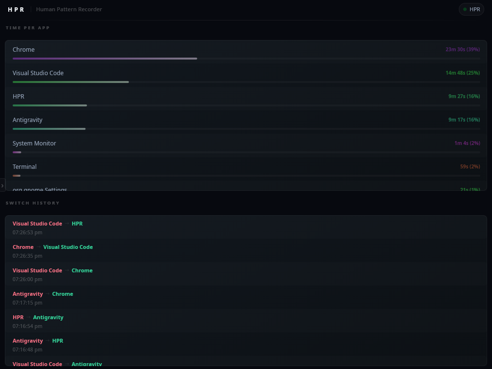
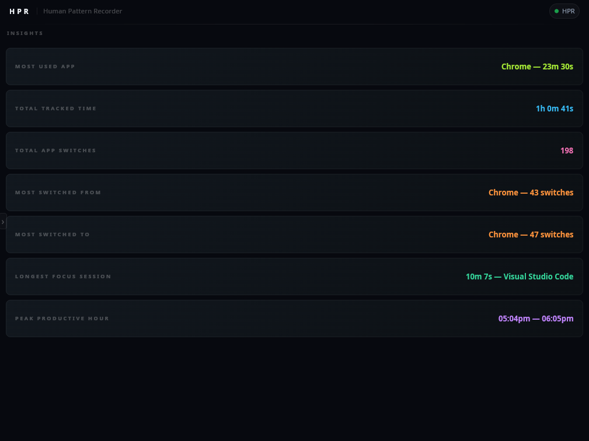

<p align="center">
  <a href="https://ko-fi.com/plexescor">
    
  </a>
</p>

<p align="center">
  
</p>

<h1 align="center">HPR &mdash; Human Pattern Recorder</h1>

<p align="center">
  
  
  
  
  
  
  
</p>

<p align="center">
  <strong>A compiled, offline, zero-account activity tracker.</strong><br/>
  Watches your active window. Builds your history. Never phones home.
</p>

---

> [!IMPORTANT]
> **HPR is now fully free and open source.**
> The premium version (previously closed source) has been merged into the free version. Every feature - current and future - is available to everyone at no cost. If HPR saves you time or you just want to support continued development, a Ko-fi donation goes a long way.
>


---

<p align="center">
  
</p>

---

<p align="center">
  
</p>

---

<p align="center">
  <strong>See HPR in action</strong><br/>
  <sub>Live window tracking, switch history, and the Insights engine - all running locally, zero accounts.</sub>
</p>

<p align="center">
  

https://github.com/user-attachments/assets/a5fbe1f1-0cdc-41c8-a77b-68f40d96d531


</p>

---

## Table of Contents

- [What It Does](#what-it-does)
- [What It Does Not Do](#what-it-does-not-do)
- [Browser Tab Tracking](#browser-tab-tracking)
- [VS Code Project Tracking](#vs-code-project-tracking)
- [System Tray](#system-tray)
- [Data Storage](#data-storage)
- [Installation](#installation)
- [Platform Support](#platform-support)
- [Performance](#performance)
- [Privacy](#privacy)
- [Comparison With Other Trackers](#comparison-with-other-trackers)
- [Aliases](#aliases)
- [Config](#config)
- [Customizing the UI](#customizing-the-ui-advanced)
- [Roadmap](#roadmap)
- [Architecture Overview](#architecture-overview)
- [Shared State and Synchronization](#shared-state-and-synchronization)
- [Event System](#event-system)
- [UI Bridging and Slint Interoperability](#ui-bridging-and-slint-interoperability)
- [Database Layer](#database-layer)
- [Timing Model](#timing-model)
- [Pattern Analysis Engine](#pattern-analysis-engine)
- [Window Name Normalization and Aliasing](#window-name-normalization-and-aliasing)
- [Class Lifecycle and Thread Management](#class-lifecycle-and-thread-management)
- [Building From Source](#building-from-source)
- [Adding a New Platform](#adding-a-new-platform)
- [Adding New Tracked Data](#adding-new-tracked-data)
- [Known Issues and Limitations](#known-issues-and-limitations)
- [Common Issues and Fixes](#common-issues-and-fixes)
- [Contributing](#contributing)

---

## What It Does

You open your computer. You work. Hours pass. You have no idea where they went.

HPR fixes that. It watches which window is in focus, every 50 milliseconds, all day. It builds a running log of exactly where your time actually went, not where you think it went. Switch from your browser to your editor, it records the transition. Switch back two hours later, it records that too. Every switch. Every minute. Every day.

At any point you get three things live:

- **What you are in right now**, updating in real time
- **Total time per application today**, displayed as `2h 14m 30s`
- **Your complete switch history**: every transition, timestamped, in order

Click the date picker and pull up any day you have ever run HPR. It loads that day's database asynchronously off a plain SQLite file sitting on your own disk. No sync step. No cloud roundtrip. No spinner talking to a server.

That is the whole pitch. A compiled binary that watches one thing and writes it down. Everything else is just what happens when you do that well.

**Tray controls:**

| Action | Windows | Linux (Waybar / KDE / Cinnamon) |
|---|---|---|
| Open HPR | Right click → **Show HPR** | Left or right click |
| Quit HPR | Right click → **Quit** | Middle click |
| Left click | Does nothing | Opens HPR |

> [!NOTE]
> On Linux, hovering over the tray icon shows **"HPR - Human Pattern Recorder"** as the tooltip title and **"Left/Right click: Open HPR \| Middle click: Quit"** as the description.

---

## Browser Tab Tracking

HPR supports tracking browser tabs per site and per tab, without requiring any browser extensions. When the active window is a supported browser (Chrome, Edge, Firefox, or Brave), HPR automatically queries the window's title (which contains the active tab name) alongside the application name. This tab usage time is aggregated and tracked separately, giving you a detailed breakdown of which websites and tabs you spend your time on.

In the UI, you can toggle how this data is displayed by clicking the **Tab View** and **Site View** buttons:
- **Tab View**: Shows raw, unaliased tab names. This allows you to differentiate between specific pages (for example, tracking time spent across two different YouTube videos).
- **Site View**: Applies rules from `tabAliases.csv` to group your tabs by website. This view collapses specific pages into their parent domains (e.g., combining all YouTube tabs into a single "YouTube" entry), showing you only the high-level sites you visited.

---

## VS Code Project Tracking

HPR tracks which VS Code project you are in, not just that VS Code is open. No extension required. No VS Code plugin to install. No marketplace. Nothing.

VS Code puts the active project name directly in its window title in the format `filename - project - Visual Studio Code`. HPR reads that title on every poll tick. When it detects the active window is VS Code (matching `code`, `vscode`, or `visual studio code` case-insensitively against the raw title), it calls the platform-specific window title getter a second time to pull the full title string and parse it:

1. Strip the trailing ` - Visual Studio Code` suffix
2. Find the last ` - ` separator in what remains
3. Everything after that separator is the project name

The ` - ` separator (with spaces) is used instead of a bare `-` because project names can contain dashes. Nobody names their project `foo - bar`, so this is a safe split point.

The result goes into `timeLog_PerProject`, a separate time accumulator that runs in parallel with the normal per-app log. In the UI you get a dedicated Project View that shows time broken down by project name for the day. You can toggle between **Raw View** (the unprocessed title substring) and the default parsed view which applies `projectAliases.csv` on top.

This works on every supported platform - Hyprland, GNOME, KDE, Cinnamon, and Windows - because each backend already has a window title getter and VS Code puts the project name in the title on all of them.

---

## What It Does Not Do

> [!CAUTION]
> If you are looking for a keylogger, a screenshot tool, or anything that reads the contents of your windows, this is not it and never will be.

HPR reads exactly one thing from your system:

**`the title of the currently focused window`**

No keystrokes. No mouse movement. No screen capture. No clipboard. No file scanning. One string, every 50ms, written locally.

HPR is also not an Electron app, not a web server, not a Python daemon, not a subscription service. It is a compiled C++23 binary. It starts in milliseconds. Under 10MB of RAM on Windows. If that sounds refreshing, it should.

---

## Data Storage

```
~/.local/share/HPR/HPR_DB/          (Linux)
%APPDATA%\HPR\HPR_DB\               (Windows)

    05-26/
        01-05-26.db
        02-05-26.db
        ...
```

One `.db` file per day. One folder per month. Standard SQLite3 that any viewer on the planet can open. Delete last month by deleting the folder. Inspect a specific Tuesday by opening it in DB Browser for SQLite. No export step. No proprietary format. No account to log into first.

A normal day of use is 30 to 100 KB. A full year sits under 50 MB total.

---

## Installation

**Arch Linux (AUR)**
HPR is available on the AUR. You can install it using your preferred helper:
```bash
yay -S hpr
```

> [!NOTE]
> No formal installer for Linux yet. For now it is three commands and you are running.

**Windows**
Download and run the setup executable. The Inno Setup installer automatically handles placing `aliases.csv`, `tabAliases.csv`, `config.csv`, and the `ui/` folder into your config directory. If you have already customized any of these files, the installer will prompt you before overwriting them, making updates completely safe. It also drops the latest default UI into `ui-REFERENCEONLY/` every time so you always have a clean reference to diff against.

**Linux (Manual)**
```bash
chmod +x installHPRConfigAndUi.sh
./installHPRConfigAndUi.sh
./HPR
```

The Linux setup script handles copying the config and UI files and provides the same safe-overwrite prompts as the Windows installer.

On first launch HPR automatically creates a desktop entry at `~/.local/share/applications/hpr.desktop`. This registers HPR with your desktop environment so it appears in your application launcher and the taskbar/dock correctly associates the window with its icon. No manual `.desktop` file setup is required.

The entry is only written when it is missing or stale. On subsequent launches HPR checks whether the `Exec=` and `Icon=` fields inside the existing file already point to the current binary and icon locations. If they match, the file is left completely untouched. If they do not match (for example, the binary was moved or rebuilt to a different path), HPR rewrites the entry to reflect the new location.

> [!NOTE]
> This only applies when running HPR directly from a build or binary without installing. If you installed via the AUR, the system-wide desktop entry at `/usr/share/applications/hpr.desktop` is already managed by the package — HPR detects this and skips the local entry entirely.

<details>
<summary>Where does everything go?</summary>

**Config**
```
Linux:   ~/.config/HPR/
Windows: %APPDATA%\HPR\HPR_Config\
```

**Data**
```
Linux:   ~/.local/share/HPR/HPR_DB/
Windows: %APPDATA%\HPR\HPR_DB\
```

</details>

---

## System Tray

HPR lives in your system tray and keeps running when you close the window. The only way to actually quit it is through the tray.

**Windows:**
- Left click → does nothing
- Right click → context menu with **Show HPR** and **Quit**
- Minimizing or closing the window hides it to tray, does not quit

**Linux (Waybar · KDE · Cinnamon):**

HPR registers as a `org.kde.StatusNotifierItem` on the session D-Bus. This is the same protocol that Discord, Steam, and every other modern app uses for tray icons on Linux. No libraries linked. No GTK. No Qt. Pure D-Bus over `libdbus-1`.

- Left or right click → open HPR (Waybar routes both clicks to the same D-Bus method, this is a Waybar limitation not an HPR one)
- Middle click → quit HPR
- Hover → shows **"HPR - Human Pattern Recorder"** with hint text **"Left/Right click: Open HPR | Middle click: Quit"**
- Closing the window hides HPR to tray, does not quit

Works with Waybar on Hyprland, KDE's system tray, and Cinnamon's panel out of the box with zero configuration.

---

## Platform Support

| Platform | Backend | Extra Setup |
|---|---|---|
| Hyprland (Wayland) | `hyprctl` IPC | None.  |
| GNOME (Wayland) | Custom GNOME Shell extension ([lol-another-window-extension](https://github.com/plexescor/lol-another-window-extension)) | One-time only. Run the bundled install script, log out, log back in. |
| KDE Plasma (Wayland / X11) | KWin scripting via `qdbus6` / `qdbus-qt6` (auto-detected) | None on most distros. Linux Mint users may need to install `qdbus` manually — see [Common Issues and Fixes](#common-issues-and-fixes). |
| Cinnamon (X11 + Wayland) | `org.Cinnamon.Eval` D-Bus method | None. |
| Windows 10 / 11 | Win32 API | None. |

<details>
<summary>GNOME setup walkthrough</summary>

On first launch HPR checks whether its GNOME extension is active. If it is not, it tells you directly rather than silently returning garbage. Run the bundled `installWindowCallsExtension.sh`, which clones and installs [lol-another-window-extension](https://github.com/plexescor/lol-another-window-extension) — a custom shell extension built specifically for HPR — and enables it. Because GNOME on Wayland cannot hot-reload shell extensions, you log out and back in once. Every launch after that is fully automatic. It was either do it this way or not support GNOME at all, and I was not leaving GNOME users out.

</details>

<details>
<summary>Cinnamon details</summary>

Cinnamon runs on top of its own window manager, **Muffin** (a fork of GNOME's Mutter). Unlike the other Linux backends, Cinnamon exposes a D-Bus method - `org.Cinnamon.Eval` - that evaluates arbitrary JavaScript directly inside the live Cinnamon process. HPR uses this to query the internal `global.display.focus_window` object:

- **Window class** (application name): `global.display.focus_window.get_wm_class()`
- **Window title** (active tab / document): `global.get_window_actors().filter(a => a.meta_window.has_focus())[0].get_meta_window().get_title()`

Because this goes through Cinnamon's own compositor internals rather than X11 display properties, it works identically on both the **X11 session** (default on Linux Mint) and the **experimental Wayland session** without any code branching. No extra tools or extensions need to be installed.

</details>

<details>
<summary>Windows details</summary>

Built without a console window so it sits in your tray and stays out of your way. No terminal flashing on launch.

</details>

---

## Performance

<details>
<summary><strong>Windows</strong></summary>

Around **8 MB RSS** in real use. That is HPR's own code plus whatever the Windows runtime pulls in. Nothing hidden in that number.

</details>

<details>
<summary><strong>Linux &mdash; read this before opening a memory issue</strong></summary>

BTOP++, htop, and similar tools will report approximately **47 MB**. That number is accurate but it is not the full picture.

HPR's actual private memory, heap plus stack plus all application data, is around **22 MB**. The remaining ~25 MB is shared GPU library pages mapped into HPR's address space by the OS because Slint uses OpenGL for rendering. The chain: Slint initializes OpenGL via EGL, Mesa's Gallium driver loads for your GPU, and Mesa unconditionally loads `libLLVM` because it needs LLVM as a JIT for driver-level shader compilation. This happens even when shaders are cached. `libLLVM` is 60+ MB and its resident pages account for most of what process monitors show above HPR's private footprint.

These pages are physically shared across every GPU-accelerated process on your system. Your compositor has them. Your browser has them. The kernel is not loading duplicate copies. The proportional cost to HPR specifically is around **50 MB PSS** (Proportional Set Size), which is the most honest single number the kernel can give you.

To verify yourself:
```bash
cat /proc/$(pgrep HPR)/status | grep -E "RssAnon|RssFile|VmRSS"
```

`RssAnon` is HPR's actual private footprint. `RssFile` is the shared library mapping. `VmRSS` is the sum that monitors display.

To eliminate the GPU overhead entirely:
```csv
hardware-acceleration,false
```

This switches Slint to a CPU software renderer. Mesa never loads. `libLLVM` never loads. RSS drops to approximately **22 MB**. The UI is visually identical. The only cost is slightly higher CPU usage during redraws, which for a tracker redrawing every 500ms is genuinely imperceptible.

</details>

<details>
<summary><strong>Cachegrind (15 second sample)</strong></summary>

```
L1 instruction miss rate:          0.20%
Last-level instruction miss rate:  0.01%
L1 data miss rate:                 2.6%
Last-level data miss rate:         0.2%
Overall last-level miss rate:      ~0.0%
```

The 2.6% L1 data miss rate is entirely inside Slint's font rendering pipeline: fontconfig resolution, FreeType hinting, parley text shaping. Not a single HPR code path appears in the profile.

</details>

<details>
<summary><strong>Callgrind (60 second sample)</strong></summary>

4.46 billion instructions executed over 60 seconds. HPR's own C++ backend did not appear in the top 15 hottest functions by instruction count. Everything in that list was Slint, FreeType, fontconfig, or parley doing text work. Background threads poll and sleep. The main thread runs the event loop. That is the design working correctly.

</details>

**CPU usage during normal operation: 1 to 3% on modern hardware. Startup time: instant.**

---

## Privacy

```
No accounts.
No telemetry.
No analytics.
No network communication. Ever.
```

The only external network call in the entire codebase is a `git clone` inside the GNOME extension install script. That is a shell command you run once manually. HPR itself at runtime touches no network, no DNS, nothing.

Your data is a folder on your disk. Removing your data means deleting that folder. No server to request deletion from. No account to close. No support ticket to file.


---

## Comparison With Other Trackers

I need users, so I am going to be completely honest about where HPR stands right now:

| Feature | HPR | ActivityWatch | RescueTime | Toggl |
|---|---|---|---|---|
| Binary size | ~2 MB | 200 MB+ | Cloud app | Cloud app |
| RAM (real footprint) | ~22 MB private / ~47 MB reported (Linux), ~8 MB (Windows) | 200 MB+ | N/A | N/A |
| Account required | No | No | Yes | Yes |
| Data leaves your machine | Never | Never | Yes | Yes |
| Automatic tracking | Yes | Yes | Yes | No |
| Native Wayland | Yes | Partial | N/A | N/A |
| System tray | Yes (native, no libs) | Yes | Yes | Yes |
| VS Code project tracking | Yes (built-in, no extension) | Via plugin | No | No |
| Embedded web server | No | Yes | No | No |
| Open source | Yes | Yes | No | No |
| Launch time | Instant | Several seconds | N/A | N/A |
| Free | Yes | Yes | Limited | Limited |

ActivityWatch is the most honest comparison. It is a mature, maintained project with a full web dashboard, browser extensions, a plugin ecosystem, and years of production use. HPR has none of that yet. What HPR has that ActivityWatch does not: a fraction of the memory footprint, native Wayland from day one, no Python runtime, no embedded web server running in the background.

If you need something mature and battle-tested today, use ActivityWatch. If the architecture and footprint appeal to you and you can tolerate being early, HPR is worth following.


---

## Aliases

Raw window titles from the OS are inconsistent. `Visual Studio Code` on one machine, `code` on another, `code.exe` on Windows. HPR ships with an `aliases.csv` that collapses all of those into one label. For browser tabs, a separate `tabAliases.csv` handles collapsing specific URLs and page titles into generic website names.

A few bundled examples:
- `code` catches `vscode`, `code-oss`, `code.exe`, and similar variants
- `terminal` catches `kitty`, `alacritty`, `konsole`, `wezterm`, and more

Adding your own is editing one line in a CSV: `raw substring,Display Name`. Lines starting with `#` are comments.

> [!TIP]
> Aliases hot-reload. Save the file, HPR picks it up within the next UI tick. No restart.

The raw OS string is always preserved untouched in the database. Aliases apply only at display time, which means renaming an alias retroactively updates every historical entry for that application with zero migration work.

---

## Config

`config.csv` is intentionally small:

```csv
use-interpreter,false       # true = load UI from config dir at runtime instead of compiled-in UI
hardware-acceleration,true  # false = CPU renderer, eliminates GPU library overhead on Linux
```

```
Linux:   ~/.config/HPR/config.csv
Windows: %APPDATA%\HPR\HPR_Config\config.csv
```

That is the full config surface for now. It will grow alongside the feature set.

---

## Customizing the UI (Advanced)

> [!IMPORTANT]
> This section is for people who want to modify HPR's visual design without touching C++ or recompiling. If that is not you, skip it.

HPR's UI is written in [Slint](https://slint.dev/). By default it is compiled into the binary at build time. Enabling interpreted mode tells HPR to load your `.slint` files from disk at runtime instead, letting you change colors, layouts, animations, and component structure without rebuilding anything.

**Enable interpreted mode:**
```csv
use-interpreter,true
```

**Your UI files live at:**
```
Linux:   ~/.config/HPR/ui/app-window.slint
Windows: %APPDATA%\HPR\HPR_Config\ui\app-window.slint
```

The setup script drops the defaults there on first run. Edit freely from that point.

> [!WARNING]
> **Do not rename structs, properties, or callbacks.** HPR's C++ backend references these by exact name to push data into the UI. Renaming them breaks the connection silently and the UI stops updating. The full interface contract is documented in `READ_ME_BEFORE_MODIFYING_UI.txt` inside your `ui/` folder. Read it before touching anything.

`ui-REFERENCEONLY/` in your config directory always holds the unmodified defaults for the current version. If you break something, diff against it.

---

## Roadmap

> [!NOTE]
> The foundational work is mostly done. Local-first tracking, privacy architecture, Insights engine, native Wayland support, lightweight footprint, offline data ownership. These are either shipped or in final approach.
>
> What comes next is refinement, not new pillars. Polish, stability, quality-of-life improvements, UI work.

**Fully Free and Open Source:**
HPR is now completely free. The premium version (previously closed source) has been merged into this repo. Full local tracking. Full data ownership. All current features and all future features including LLM-powered pattern analysis, Focus mode with application blocking, and Advanced reporting - all free, forever.

If HPR is useful to you, please consider supporting development:

---

# For Developers and Power Users

---

## Architecture Overview

HPR is a multi-threaded C++23 application organized around a single shared state struct. Four threads run concurrently with defined responsibilities and defined cadences:

```
Main Thread          (Slint event loop)
  Window Poller      [50ms  tick  -  CurrentWindowManager]
  UI Bridge          [500ms tick  -  HPR / HPRInterpreter + UiModelManager]
  Database Writer    [10s   tick + event-driven  -  DatabaseManager]
```

**Main thread** is `main.cpp`. It instantiates `ConfigManager`, `DatabaseManager`, and `CurrentWindowManager`, picks either `HPR` or `HPRInterpreter` based on config, then enters the Slint event loop.

**Window poller** lives in `CurrentWindowManager::getCurrentWindow_Loop`. It calls the platform-specific window getter every 50ms, acquires `stateMutex`, and updates the current window name and accumulated time.

**UI bridge** is `HPR::trackingLoop` or `HPRInterpreter::trackingLoop`. It wakes every 500ms, reads application and tab state, and dispatches model updates to the Slint main thread using `UiModelManager` via `slint::invoke_from_event_loop`. User interactions flow back through `UiEventBridge` into `EventHub`.

**Database writer** is `DatabaseManager::writeLoop`. It flushes to SQLite every 10 seconds and also responds to `LOAD_DATABASE_SINGULAR` events to load historical data asynchronously without touching the UI thread.

---

## Shared State and Synchronization

All mutable shared data lives in one place:

```cpp
namespace AppState {
    struct AppState {
        std::string currentWindow;
        std::string previousWindow;
        std::map<std::string, long> timeLog_PerApp;
        std::map<std::string, long> timeLog_PerTab;
        std::map<std::pair<std::string, std::string>, std::vector<uint64_t>> switchHistory;
    };
    extern AppState state;
    extern std::mutex stateMutex;
}
```

Instantiated exactly once in `appState.cpp`. Every thread that touches it acquires `stateMutex` via `std::lock_guard`. The locking strategy is deliberately coarse-grained: lock the whole struct, copy what you need, release immediately, do all work on the copy. Locks are always scoped inside `{}` so the hold duration is obvious in the code.

`timeLog_PerApp` and `timeLog_PerTab` accumulate raw millisecond durations per application name and browser tab, respectively. `switchHistory` keys on `std::pair<string, string>` (from, to) and stores a `vector<uint64_t>` of Unix millisecond timestamps for every recorded transition between those two applications.

---

## Event System

The UI layer and database layer have no direct references to each other. They communicate through `EventHub`, a centralized in-process pub/sub bus with typed payloads.

```cpp
// Subscribe
EventHub::connect(Event::HISTORY_LOADED_SINGULAR, [this](EventData data) { ... });

// Publish
EventHub::emit(Event::LOAD_DATABASE_SINGULAR, DatabaseDate_Singular{requestedDate});

// Cleanup
EventHub::disconnect(Event::HISTORY_LOADED_SINGULAR, id);
```

`EventData` is a `std::variant`. Payloads are type-safe at the call site. Subscribers get an integer ID on connection and use it to unsubscribe in their destructor. No dangling listeners.

---

## UI Bridging and Slint Interoperability

Two execution modes, one abstraction layer:

| Mode | Class | Mechanism |
|---|---|---|
| Compiled | `HPR` | Slint generates C++ from `.slint` at build time. Maximum performance, smallest footprint. |
| Interpreted | `HPRInterpreter` | Slint loads `.slint` from the config directory at runtime. Modify the UI without rebuilding. |

`UiModelManager` abstracts the difference. It provides `update()` for compiled mode and `update_Interpreted()` for interpreted mode, both populating the same Slint `VectorModel`s from raw C++ data. All writes are dispatched to the main thread via `slint::invoke_from_event_loop` because Slint UI objects are not thread-safe.

Model sync uses a surgical in-place update rather than clearing and repopulating. Clearing the model causes layout panics during resize and maximize. I found that the hard way, and this is the fix that has held since:

```cpp
auto syncModel = [](auto model, const auto& vec) {
    size_t existing = model->row_count();
    size_t incoming = vec.size();
    size_t overlap  = std::min(existing, incoming);
    for (size_t i = 0; i < overlap; ++i)
        model->set_row_data(i, vec[i]);
    while (model->row_count() > incoming)
        model->erase(model->row_count() - 1);
    for (size_t i = existing; i < incoming; ++i)
        model->push_back(vec[i]);
};
```

---

## Database Layer

`sqlite_modern_cpp` is a header-only C++ wrapper over SQLite3. SQLite3 is the official single-file amalgamation compiled directly into the binary. Zero external database dependencies.

**Write strategy per table:**

```
app_usage      UNIQUE on app name   →  INSERT OR REPLACE   →  one row per app, always current
switch_history UNIQUE on timestamp  →  INSERT OR IGNORE    →  dump full history every flush, SQLite drops duplicates silently
```

`INSERT OR IGNORE` on switch history means the write loop never needs to diff in-memory state against the database. It dumps everything and lets SQLite handle deduplication. Simple and reliable.

**Every connection opens with:**
```sql
PRAGMA journal_mode=WAL;
PRAGMA synchronous=NORMAL;
```

A passive WAL checkpoint runs after every write cycle. This was added after hitting real WAL corruption on Btrfs with LUKS encryption during development. Not theoretical caution.

The writer sleeps in 100 intervals of 100ms rather than one 10-second block. HPR exits within 100ms of shutdown instead of hanging for a sleep to expire.

**Single-instance lock:**

| Platform | Mechanism | On crash |
|---|---|---|
| Windows | `CreateFileA` with `FILE_FLAG_DELETE_ON_CLOSE` | Lock file auto-deletes even if HPR crashes hard |
| Linux | `flock(LOCK_EX \| LOCK_NB)` | Kernel releases the lock automatically on process death |

A second launch detects the lock and exits immediately.

---

## Timing Model

| Clock | Role |
|---|---|
| `std::chrono::steady_clock` | Duration measurement between poll ticks. Monotonic. Immune to NTP corrections, DST transitions, and manual clock changes. |
| `std::chrono::system_clock` | Recording switch timestamps for display only. Never used in arithmetic. |

Using `system_clock` for duration measurement is a classic bug that corrupts accumulated totals when NTP fires or DST changes mid-session. I specifically designed around this. Measurement and display use different clocks on purpose and that separation is enforced in code.

---

## Pattern Analysis Engine

`PatternAnalyzer` is the engine behind the Insights view. Every 30 seconds inside `trackingLoop`, it acquires a lock on `stateMutex`, copies the current state, releases immediately, then runs seven analysis passes on the copy.

**Patterns 1 through 5** are direct aggregations over `timeLog_PerApp` and `switchHistory`: most-used application, total tracked time today, top switch pairs, switch frequency distribution.

**Pattern 6: Longest Focus Session**

Uses a Chronological Event-Matching Algorithm. The raw `switchHistory` map is flattened into a unified event timeline of arrivals and departures for every application, sorted globally by timestamp in O(N log N). One pass through the sorted list pairs each arrival with its next departure. If a session was interrupted by a crash or reboot and never received a departure event, the orphaned arrival is simply overwritten by the next session start for that application. No ghost sessions spanning multiple days. No special crash-recovery logic required.

**Pattern 7: Peak Productive Hour**

Uses a Sliding Window Heuristic. A window constrained between 60 and 90 minutes slides across the complete timestamp timeline. At every position, it counts the number of application switches inside the window. The position with the fewest switches is reported as Peak Productive Hour. The reasoning: sustained low switch frequency is the strongest observable signal of deep focus without requiring the user to manually mark sessions.

Both patterns filter out HPR itself, the Unknown state, and known system noise before running. Insights reflect actual work.

---

## Window Name Normalization and Aliasing

OS window APIs return raw strings that are inconsistent, noisy, and occasionally nonsensical. `validateAndUpdateWindow_Cross` in `validateAndUpdateWindow.cpp` is the first normalization pass:

```cpp
if (windowName.contains("searchhost")
    || windowName.contains("plasmashell")
    || windowName.contains("js::")       // KWin JS runtime artifact during injection
    || windowName.contains("null")
    // ...
    )
    return "Unknown";
```

The `js::` filter is specifically for KDE. The KDE backend injects a JavaScript payload into KWin via `qdbus6` (or `qdbus-qt6` on Fedora - auto-detected at startup) on every tick, and during that injection KWin's own JS runtime briefly appears as the active window. Without this filter, strings like `js::kwin_tmp_1234` silently accumulate time in your log every single poll cycle.

**Late-binding aliases:**

The database stores raw OS strings exactly as received. Aliases are resolved at display time only, never written. The consequence: renaming an alias in `aliases.csv` retroactively updates every historical entry for that application across every stored day with zero migration, because the raw data was never overwritten.

`AliasManager` runs an O(N) substring scan through alias rules the first time it sees a new window name, caches the result in an `unordered_map` for O(1) on every subsequent lookup. File is hot-reloaded on change. No restart needed.

---

## Class Lifecycle and Thread Management

Every class that owns a background thread follows the same contract:

```
Constructor  →  allocate resources, do NOT start the thread
run()        →  spawn the thread
thread body  →  check std::atomic<bool> running each iteration
destructor   →  set running = false, join() if joinable()
```

Shutdown is always clean. The database writer finishes its current flush before the process exits. Force-close HPR and your data is still intact.

---

## Building From Source

**Requirements:**
- CMake 3.21+
- GCC 13+, Clang 16+, or MSVC 2022+ with C++23 support
- Slint 1.16.1 (the install script handles this)
- Linux only: `jq` for Hyprland, `gdbus` for GNOME and Cinnamon, `qdbus6` / `qdbus-qt6` for KDE (HPR auto-detects which is available)


```bash
git clone https://github.com/plexescor/HPR
cd HPR
```

**Linux - install Slint (choose one):**
```bash
# System-wide (requires sudo, cmake finds Slint automatically)
sudo ./installDependencies.sh

# User-local (no sudo needed)
./installDependencies.sh
```

Windows: run `installDependencies.bat`. Pulls Slint 1.16.1, `slint-lsp`, and `slint-viewer` from GitHub releases.

**Build:**
```bash
mkdir build && cd build

# If you ran the install script without sudo:
cmake .. -DCMAKE_PREFIX_PATH="$HOME/.local"

# If you ran with sudo (system-wide):
cmake ..

cmake --build . --parallel 8
```

SQLite is the official single-file amalgamation in `external/sqLite/`, compiled into the binary directly. No system SQLite packages needed. CMake copies `aliases.csv`, `config.csv`, `ui/`, `assets/`, and the install scripts next to the output binary automatically. A fresh build is immediately runnable from the build directory.

---

## Adding a New Platform

Platform window detection is fully contained inside `CurrentWindowManager`. The constructor reads `$XDG_CURRENT_DESKTOP` and dispatches to the right backend through `getCurrentWindow()`.

To add a new platform:

1. Declare `getCurrentWindow_YourPlatform()` in `getCurrentWindow.hpp`
2. Implement it in `getCurrentWindow.cpp`. Return the raw window title as `std::string`. Return an empty string for transitional or unknown states.
3. Add an `else if (currentPlatform.contains("YourPlatform"))` branch in `getCurrentWindow()`
4. Add initialization checks in the `CurrentWindowManager` constructor inside the appropriate preprocessor guard

`validateAndUpdateWindow_Cross` runs on every return from the platform getter automatically. New backends inherit all normalization and noise filtering for free.

---

## Adding New Tracked Data

The extension points follow a fixed five-step order:

1. **Slint:** Add a new property, struct, or UI element to `app-window.slint`
2. **State:** Add the field to `AppState::AppState` in `appState.hpp`
3. **Collection:** Populate it inside `getCurrentWindow_Loop()` within the `lock_guard` block
4. **Bridge:** Thread the field through `modelManager.update()` (as seen with `timeLog_Tab`) in both `HPR.cpp` and `HPRInterpreter.cpp`. Use `syncModel` for any collection type to prevent resize panics.
5. **Persistence:** Add the table in `DatabaseManager::initDatabase` and flush it in `writeLoop`

---

## Known Issues and Limitations

> [!WARNING]
> **GNOME without the extension:** If [lol-another-window-extension](https://github.com/plexescor/lol-another-window-extension) is absent, HPR sets its internal platform identifier to `GNOME_NO_EXTENSION` and returns an instruction string from the poll loop rather than a window name. It will not attempt to run the install script autonomously. That is intentional behavior, not a bug.

> [!WARNING]
> **KDE backend:** The KDE backend injects a JavaScript payload into KWin via `qdbus6` / `qdbus-qt6` (auto-detected at startup) on every 50ms tick and scrapes the system journal for the output. That means shell forks and disk reads at 20 Hz. Somehow this lands at around 1% CPU, which surprised me as much as it will surprise you. Every other approach I tested did not work. This one does and has been validated across multiple KDE configurations. It is a hack. It is a working hack. I am at peace with it.

> [!NOTE]
> **Linux platform detection:** HPR reads `$XDG_CURRENT_DESKTOP` and matches substrings via `std::string::contains`. Non-standard desktop session variables or nested compositor configurations may not resolve correctly.

> [!NOTE]
> **Cinnamon Wayland:** Cinnamon's Wayland session is still experimental in Linux Mint. The `org.Cinnamon.Eval` D-Bus backend works on both X11 and Wayland sessions, but Wayland-specific stability or behavior changes are dependent on the Cinnamon/Muffin team's ongoing development.

---

## Common Issues and Fixes

<details>
<summary><strong>KDE: HPR is not tracking the active window</strong></summary>

HPR's KDE backend works by injecting a small JavaScript snippet into KWin over D-Bus using `qdbus6` or `qdbus-qt6`. These are Qt6 debugging utilities. They are **not** installed by default on a standard KDE desktop — they ship as part of Qt's developer/tooling packages.

If HPR launches on a KDE session but the active window is never detected (always shows Unknown or empty), install the relevant package for your distribution:

**Arch Linux**
```bash
sudo pacman -S qt5-tools
```

**Ubuntu / Debian / KDE Neon / Linux Mint**
```bash
sudo apt install qdbus-qt5
# or for Qt6:
sudo apt install qt6-tools-dev
```

**Fedora**
```bash
sudo dnf install qt6-qttools
```

**openSUSE**
```bash
sudo zypper install qt6-tools
```

After installing, restart HPR. It auto-detects the available binary (`qdbus6` → `qdbus-qt6` → `qdbus`) at startup.

> [!NOTE]
> This is a one-time install. The Qt6 tools package is small and has no runtime overhead on HPR itself.

</details>

---

## Contributing

The full codebase is readable in one sitting if you go in this order:

```
main.cpp              →  startup, config loading, thread orchestration
appState.hpp          →  the shared data model, the center of everything
getCurrentWindow.cpp  →  platform-specific window polling per backend
databaseManager.cpp   →  persistence, WAL, lock file, midnight database rollover
uiModelManager.cpp    →  how C++ state becomes Slint models in both UI modes
```

One rule for all new code: anything that touches shared state goes through `AppState::stateMutex`. Lock, copy, release, work on the copy. Every existing access follows this pattern.

No formal process. Open an issue or submit a pull request.

If HPR has been useful to you, a Ko-fi helps keep development going:

---

<p align="center">
  <sub>
    Active development &nbsp;|&nbsp; v0.6 &nbsp;|&nbsp;
    Hyprland · GNOME · KDE Plasma · Cinnamon · Windows 10/11 &nbsp;|&nbsp;
    C++23 · Slint 1.16.1 · SQLite3 amalgamation · sqlite_modern_cpp
  </sub>
</p>
