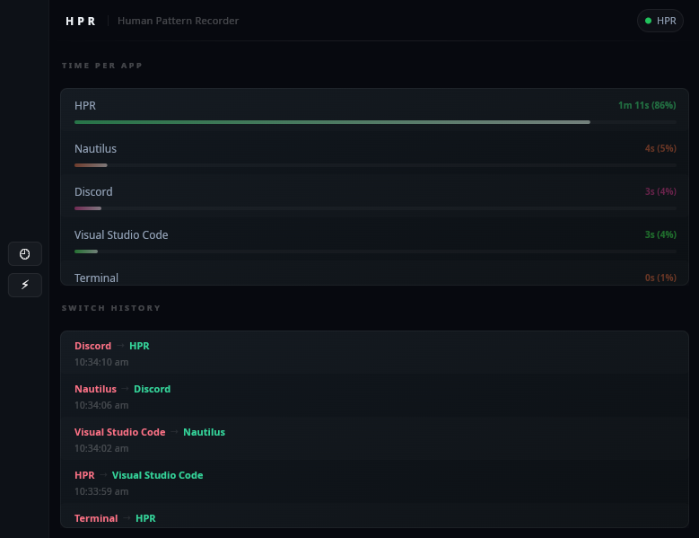

# HPR - Human Pattern Recorder

<p align="center">
  
</p>

>Recursion

A lightweight, offline activity tracker for Windows and Linux. HPR runs silently in the background and tells you exactly where your time goes, down to the millisecond, without ever talking to a server, requiring an account, or eating your RAM.

> Currently in active development. Core tracking and persistence are fully functional. UI is pretty, the data is real.

<p align="center">
  
</p>

---
---

# FOR USERS

---

## What Is HPR

HPR is an application tracker. It watches which window is active on your screen and builds a log of how much time you spend in each application, every day. When you switch from Chrome to VSCode, it records that. When you come back, it picks up where it left off. When you close and reopen HPR the next day, your history from today is already loaded.

Everything it records lives in a folder on your machine called `HPR_DB` inside your local application data directory (`~/.local/share/HPR/HPR_DB/` on Linux, `%APPDATA%\HPR\HPR_DB\` on Windows). Nothing goes anywhere else. There is no server, no account, no API key, no analytics endpoint. The only internet activity that ever happens is a one-time Git clone on GNOME systems to set up a required shell extension, and that is a shell command the OS runs, not HPR itself.

## What HPR Is Not

HPR does not take screenshots. It does not log keystrokes. It does not record mouse movement. It does not read the contents of your windows. It reads exactly one thing: the name of the currently active application. That is the full scope of what it captures.

HPR is also not a subscription service, not a SaaS dashboard, and not an Electron app. It is a compiled C++ binary. It starts in milliseconds and uses under 30MB of RAM while running.

## What It Actually Shows You

At the moment HPR shows you three things in real time:

The name of the application you are currently in. The total time you have spent in each application today, shown in a human readable format like `2h 14m 30s`. The history of every application switch you made, showing which app you switched from, which app you switched to, and at what time the switch happened.

This is the foundation. Analytics, insights, focus mode, and more are planned and described in the roadmap section below.

## Where Your Data Goes

HPR stores your data in SQLite database files organized like this:

```
~/.local/share/HPR/HPR_DB/ (Linux)
%APPDATA%\HPR\HPR_DB\ (Windows)
    05-26/
        01-05-26.db
```

One file per day. One folder per month. To delete everything from last month, delete the folder. To see exactly what was recorded on any specific day, open that day's `.db` file with any SQLite viewer. The files are completely standard SQLite, compatible with every SQLite tool ever made. A typical day of usage produces a file somewhere between 30 and 100 kilobytes. A full year of data is well under 50 megabytes.

## Platform Support

HPR works on Hyprland (Linux, Wayland), GNOME (Linux, Wayland), KDE Plasma (Linux, Wayland/X11), and Windows 10 and 11.

On Hyprland, setup is zero effort. HPR queries the compositor directly using `hyprctl` and everything works on first launch.

On GNOME with Wayland, HPR requires a shell extension called `window-calls-extended` to expose the focused window information. On first launch, HPR checks whether the extension is already working. If it is not, HPR will prompt you to run the `installWindowCallsExtension.sh` script that ships next to the binary. That script clones and enables the extension for you. Because GNOME on Wayland cannot reload shell extensions without a session restart, you will need to log out and back in once after running it. After that one-time setup, subsequent launches work without any intervention.

On KDE Plasma, HPR uses KWin's scripting API via `qdbus6` to query the active window. No additional setup is required.

On Windows, HPR uses the Win32 API to query the active process name. No additional setup is required. The binary is built without a console window so it runs cleanly in the background.

## Comparison With Other Trackers
>Come on, a table like this increases your `users`.

| Feature | HPR | ActivityWatch | RescueTime | Toggl |
|---|---|---|---|---|
| Binary size | ~2 MB (excluding dynamic library) | 200 MB+ | Cloud app | Cloud app |
| RAM usage | ~8 MB (Windows) ~20MB (KDE and GNOME) ~30 MB (Hyprland) | 200 MB+ | N/A | N/A |
| Requires account | No | No | Yes | Yes |
| Data leaves your machine | Never | Never | Yes | Yes |
| Auto-tracking | Yes | Yes | Yes | No |
| Wayland support | Yes | Partial | N/A | N/A |
| Requires running web server | No | Yes | No | No |
| Open source | Yes | Yes | No | No |
| Startup time | Instant | Several seconds | N/A | N/A |
| Free | Yes (premium planned) | Yes | Limited | Limited |

The closest honest comparison is ActivityWatch. ActivityWatch is a mature project with a full web dashboard, browser extensions, plugin ecosystem, and multiple years of development. HPR is early-stage and has none of those things yet. What HPR has that ActivityWatch does not is a significantly smaller footprint, native Wayland support from day one, no embedded web server, and no Python runtime. If you want a mature tool today, use ActivityWatch. If you want something that will eventually be faster and leaner, HPR is being built for that.

## Customizing the UI (Advanced Users)

HPR features a unique **Interpreted UI Mode** that allows you to modify the look and feel of the application without needing to touch a single line of C++ or recompile the binary. By default, HPR uses a pre-compiled UI for speed, but you can override this to use your own custom `.slint` files.

### 1. Enable Interpreted Mode
To tell HPR to use your custom UI files instead of the built-in one, you need to edit your `config.csv` file.

- **Location**:
  - **Linux**: `~/.config/HPR/config.csv`
  - **Windows**: `%APPDATA%\HPR\HPR_Config\config.csv`

Add (or change) the following line in the file:
```csv
use-interpreter,true
```

### 2. Add Your UI Files
HPR looks for a file named `app-window.slint` in a specific directory. You can copy the default UI files from a `ui` folder shipped with HPR folder into the locations below and start tweaking them. (Or you can run the given script to do it for you.)

> [!IMPORTANT]
> When modifying the `.slint` files, you **must** keep the names of all structs, properties, and callbacks exactly as they are in the original file. HPR's C++ logic depends on these specific names to send data to the UI. As long as the names remain identical, you can change everything else—colors, layouts, sizes, and logic—to your heart's content.

- **Storage Path**:
  - **Linux**: `~/.config/HPR/ui/`
  - **Windows**: `%APPDATA%\HPR\HPR_Config\ui\`

Once enabled, HPR will load `app-window.slint` at startup. This means you can change colors, layouts, and animations using the [Slint design language](https://slint.dev/) and see the results just by restarting the app.

---

## Roadmap

The following is what is actually planned in roughly the order it will be built.

Human-readable insights derived entirely from code, no LLM involved. Things like most-used application today, longest uninterrupted focus session, total tracked time, and which application you switch away from most frequently. These are simple calculations on data HPR already has.

Historical session browser so you can look at past days without opening SQLite files manually.

Data export to CSV and JSON.

A premium tier is planned for the future. The free tier will always include full local tracking, full data ownership, and the code-derived basic insights. The premium tier is intended to include LLM-powered pattern analysis that can read your usage data and give you personalized observations about your working patterns, focus mode with application blocking, and advanced reporting, browser tabs usage. This is not imminent.

---
---

# FOR DEVELOPERS AND POWER USERS

---

## Architecture Overview

HPR is a multi-threaded C++23 application built around a centralized shared state model. The threading architecture utilizes four distinct threads running concurrently. This design ensures the UI remains fully responsive while blocking I/O and polling operations occur asynchronously.

1.  **Main Thread (UI Loop):** The main thread serves as the entry point in `main.cpp`. It instantiates the `ConfigManager` to load settings (such as toggling the Slint interpreter), then initializes the `DatabaseManager` and `CurrentWindowManager`. Depending on the configuration, it instantiates either the compiled `HPR` class or the dynamic `HPRInterpreter` class and enters the Slint event loop.
2.  **Window Polling Thread:** Encapsulated within the `CurrentWindowManager` class. The `getCurrentWindow_Loop` method runs continuously, invoking the platform-specific active window getter every 50 milliseconds. It acquires `AppState::stateMutex` to update the current window name and accumulate elapsed time.
3.  **UI Bridge & Model Management:** Handled by the `HPR` or `HPRInterpreter` classes in conjunction with `UiModelManager`. The `trackingLoop` wakes every 500 milliseconds, reads the raw C++ state, and uses `UiModelManager` to update the Slint-specific models (either compiled or interpreted). Interactions from the UI are handled by `UiEventBridge`, which translates Slint callbacks into application events.
4.  **Database Writer Thread:** Encapsulated within the `DatabaseManager` class in the `writeLoop` method. It wakes every 10 seconds to copy `AppState` data and flushes it to a per-day SQLite database. It also listens for `LOAD_DATABASE_SINGULAR` events to asynchronously load historical data from past files.

## Shared State and Synchronization

All shared mutable data resides in a globally accessible namespace defined in `appState.hpp`:

```cpp
namespace AppState {
    struct AppState {
        std::string currentWindow;
        std::string previousWindow;
        std::map<std::string, long> timeLog_PerApp;
        std::map<std::pair<std::string, std::string>, std::vector<uint64_t>> switchHistory;
    };
    extern AppState state;
    extern std::mutex stateMutex;
}
```

The state is instantiated exactly once in `appState.cpp`. Every thread accessing this state must acquire `stateMutex` using `std::lock_guard<std::mutex>`. The application employs a coarse-grained locking strategy where the entire struct is locked simultaneously. Locks are typically acquired within scoped blocks `{}` to ensure the mutex is held for the absolute minimum duration required.

The `timeLog_PerApp` map accumulates raw duration in milliseconds. The `switchHistory` map utilizes a `std::pair<std::string, std::string>` representing the source and destination windows as the key. The value is a `std::vector<uint64_t>` storing Unix millisecond timestamps representing every recorded instance of that transition.

## UI Bridging and Slint Interoperability

The Slint declarative framework requires data to be packaged in specific models. HPR supports two modes of UI execution, both managed by `UiModelManager`:

*   **Compiled Mode (`HPR` class):** Uses the Slint compiler to generate C++ code from `.slint` files at build time. This offers maximum performance and a smaller deployment footprint.
*   **Interpreted Mode (`HPRInterpreter` class):** Uses the Slint interpreter to load `app-window.slint` dynamically from `~/.config/HPR/ui/` at runtime. This allows users to customize the UI layout, colors, and animations without recompiling the binary.

The `UiModelManager` abstracts these differences, providing `update()` and `update_Interpreted()` methods to populate Slint `VectorModel`s from raw C++ data. 

**Event Bridging:**
User interactions (like clicking a button to view a past date) are handled by `UiEventBridge` (or `UiEventBridge_Interpreted`). It registers callbacks with the Slint UI that emit internal application events via a centralized `EventHub`. For example, requesting historical data emits a `LOAD_DATABASE_SINGULAR` event, which the `DatabaseManager` picks up to perform an asynchronous file read.

Because Slint objects are not thread-safe, all UI updates and model manipulations are dispatched to the main thread via `slint::invoke_from_event_loop`.

```cpp
// Update logic abstracted by UiModelManager
modelManager.update(timeLog, switchHistory, window, totalTime, aliasManager);

// Dispatched to UI thread
slint::invoke_from_event_loop([weak, window, timeLog_Vec, switchHistory_Vec]() {
    if (auto handle = weak.lock()) {
        // ... Slint model updates ...
    }
});
```

Inside the lambda, the weak handle is promoted to a strong handle. The generated setter methods are invoked, passing the vectors wrapped in `std::make_shared<slint::VectorModel<...>>`.

## Database Layer Implementation

The database layer is managed by `DatabaseManager` and depends on `sqlite_modern_cpp`, a header-only C++ wrapper over the standard SQLite3 C library. The SQLite3 source code is compiled directly into the HPR binary to ensure zero external system dependencies.

The database connection is managed as a `std::optional<sqlite::database>` to tightly control its initialization and lifecycle. The connection is established via `db.emplace(filePath + fileName)` in `initDatabase()` and remains open until the `DatabaseManager` object is destroyed.

The database schema implements two distinct persistence strategies:

*   `app_usage`: Enforces a `UNIQUE` constraint on the `name` column and relies on `INSERT OR REPLACE` statements. This ensures exactly one row exists per tracked application. Every database flush overwrites the previous duration with the newly accumulated total.
*   `switch_history`: Enforces a `UNIQUE` constraint on the `timeStamp` column and relies on `INSERT OR IGNORE` statements. The write loop indiscriminately attempts to insert the entire history vector on every flush. The SQLite engine silently drops duplicate timestamps, ensuring each switch event is recorded exactly once without requiring complex diffing logic in the application code.

Database files are stored hierarchically by month and day. `DatabaseManager::updateFilePath()` queries the operating system for the user profile directory and constructs paths in the format `.../HPR/HPR_DB/MM-YY/DD-MM-YY.db`. 

**Asynchronous History Loading:**
When a user requests to view data from a past date, the `DatabaseManager` performs an asynchronous load via `std::async`. It resolves the path for the requested date, performs a WAL checkpoint to ensure data integrity (even if the app crashed that day), and populates a separate `historicalData_State`. Once the load is complete, it emits a `HISTORY_LOADED_SINGULAR` event to notify the UI to refresh its display.

## Timing Model

The application enforces a strict separation between duration measurement and wall-clock timestamps:

*   `std::chrono::steady_clock`: Used exclusively in `CurrentWindowManager::getCurrentWindow_Loop` to measure elapsed time between polling intervals. The steady clock is monotonic; it is guaranteed to only move forward and is unaffected by system time adjustments, NTP synchronizations, or Daylight Saving Time shifts. This guarantees precision in duration accumulation.
*   `std::chrono::system_clock`: Used to record the exact moment a window switch occurs. These timestamps are generated via `time_since_epoch()` and stored as raw `uint64_t` milliseconds in the `AppState` and the database. The `timeUtils.cpp` module provides helper functions relying on `std::localtime` and `std::put_time` to convert these epoch values into human-readable strings precisely at the moment of UI dispatch.

## Window Name Normalization & Custom Aliasing

Raw window titles retrieved from operating system APIs are often inconsistent or cluttered. The `validateAndUpdateWindow_Cross` function in `validateAndUpdateWindow.cpp` acts as the first layer of the normalization pipeline.

The pipeline strips trailing newline and carriage return characters left over from shell command outputs utilizing `pop_back()`. It then generates a lowercased copy using `std::transform` for case-insensitive matching. Known system background processes, temporary window wrappers, and KWin internal JavaScript execution environments are explicitly discarded and replaced with the literal string "Unknown".

**Late-Binding Custom Aliases:**
Unlike other trackers that hardcode translations or overwrite database history, HPR uses a Late-Binding architecture via the `AliasManager` class. The database stores the raw, mathematically pure OS strings. 

During the UI update loop (managed by `UiModelManager` and invoked by the `trackingLoop`), these raw strings are dynamically translated using a `aliases.csv` file (automatically copied to the binary path via CMake). This file allows users to define custom substring matches without touching C++ code. To ensure maximum performance, `AliasManager` employs a "Hybrid Memoization" architecture: it performs an initial O(N) substring search (`std::string::contains`) through the CSV rules, and instantly saves the result to an O(1) `std::unordered_map` RAM cache for all subsequent queries. Additionally, it supports Hot Reload.

## System Command Execution

On Linux platforms, HPR relies on executing shell commands to query window managers. The `windowUtilities.cpp` file provides a robust `runSystemCommand` wrapper function. It utilizes `popen` to spawn a shell process with read access, reads the standard output stream into a fixed-size buffer using `fgets`, appends the buffer to a `std::string`, and cleans up the process utilizing `pclose`, capturing the exit code for error handling.

## Class Lifecycle and Thread Management Pattern

Classes that manage background threads (`CurrentWindowManager`, `HPR`, `DatabaseManager`) follow a strict lifecycle pattern to guarantee deterministic application shutdown.

The class constructor allocates resources and performs initial validation but does not start the thread. A dedicated `run()` method spawns the `std::thread` and binds it to the internal looping function. The class maintains a `std::atomic<bool> running` flag initialized to true. The background loop strictly checks this flag on every iteration.

When the application exits, object destructors are invoked. The destructor sets `running = false` and calls `join()` on the thread object if `thread.joinable()` evaluates to true. This blocks the main thread from exiting until all background tasks complete their current iteration, preventing memory corruption or segmentation faults during teardown.

## Building From Source

Requirements:

*   CMake 3.21 or later
*   GCC 13+, Clang 16+, or MSVC 2022+ with C++23 support
*   Slint 1.16.1 (installed via the provided script, see below)
*   On Linux: `jq` for Hyprland, `gdbus` for GNOME, `qdbus6` for KDE

Install Slint and its associated tooling system-wide using the provided shell script. This script automatically downloads Slint 1.16.1, `slint-lsp`, and `slint-viewer` binaries from GitHub releases, extracts the archives into the `external/` directory, and installs the libraries and binaries to `/usr/local/`.

```bash
git clone https://github.com/plexescor/HPR
cd HPR
sudo ./installDependencies.sh
```

On Windows operating systems, execute `installDependencies.bat` instead of the shell script.

Once dependencies are installed, configure and build the CMake project:

```bash
mkdir build && cd build
cmake ..
cmake --build . --parallel 8
```

SQLite is bundled as the official single-file amalgamation within `external/sqLite/` and is compiled directly into the binary as part of the CMake build process. No system-level SQLite development packages are required.

## Adding A New Platform

Platform-specific window detection is isolated entirely within `CurrentWindowManager`. On Linux, the constructor parses the `$XDG_CURRENT_DESKTOP` environment variable to identify the active desktop environment. The `getCurrentWindow()` method then dispatches to the appropriate platform-specific getter function.

To implement a new platform backend:

1.  Declare a new private method, such as `getCurrentWindow_YourPlatform()`, within `getCurrentWindow.hpp`.
2.  Implement the method in `getCurrentWindow.cpp`. The function must return the raw active window title as a `std::string`.
3.  Add an `else if (currentPlatform.contains("YourPlatform"))` branch to the routing logic in `getCurrentWindow()`.
4.  If the platform requires initialization checks, execute the logic in the `CurrentWindowManager` constructor inside an appropriate preprocessor guard.

The normalization function `validateAndUpdateWindow_Cross` executes immediately after the platform getter returns, ensuring new platform implementations do not need to implement independent string cleanup or application mapping logic.

## Adding New Tracked Data

The application architecture is designed to be easily extensible. To track a new user metric:

1.  **Define in Slint**: Update `app-window.slint` with a new property or struct declaration and an appropriate UI element to render the data.
2.  **Define in State**: Add the new field or collection within the `AppState::AppState` struct in `appState.hpp`.
3.  **Collect Data**: Update `getCurrentWindow_Loop()` to populate the new field. Ensure this operation occurs strictly within the `std::lock_guard<std::mutex>` block.
4.  **UI Bridge**: Update the `trackingLoop` (in `HPR.cpp` or `HPRInterpreter.cpp`) to pass the new field into the `modelManager.update()` call, which then handles the UI thread dispatch via `slint::invoke_from_event_loop`.
    *   *Crucial*: If the data is a collection (like a list), use the `syncModel` helper (now located within the `UiModelManager::update` logic) to perform a surgical update. This prevents UI crashes during layout changes (like window maximization).
5.  **Persistence**: Update `DatabaseManager::initDatabase` to create the required table and modify `writeLoop` to persist the new field.

## Known Issues and Limitations

*   **GNOME Extension Handling:** If the `window-calls-extended` extension is absent on GNOME, HPR detects the failure via a `gdbus` call and sets the platform string to `GNOME_NO_EXTENSION`. This triggers the polling loop to return a hardcoded string instructing the user to execute `installWindowCallsExtension.sh`. HPR does not attempt to invoke the installation script autonomously. The script handles cloning the repository and enabling the extension via `gnome-extensions enable`.
*   **KDE Backend Performance:** The KDE backend relies on injecting a temporary JavaScript payload into KWin via `qdbus6` and scraping the system journal for the subsequent print output. This process triggers multiple shell invocations and disk I/O operations on every 50-millisecond polling tick. Though I didn't expect, is uses `~1%` CPU on KDE which is `*lower*` Win32 API calls used on Windows or the direct `hyprctl` JSON query utilized on Hyprland.Now defending myself, I didn't `blindly` came to this conclusion, I tested other methods but they didn't work.

*   **Linux Platform Identification:** The application relies on `$XDG_CURRENT_DESKTOP` to identify the Linux compositor. This string is parsed loosely using `std::string::contains`. Edge cases where users run nested compositors or non-standard session variables may result in undefined/unintended behavior. Keeping your system sane will help HPR run.

## Contributing

The codebase is organized specifically to be comprehensible in a single reading session. The recommended reading order is:

1.  `main.cpp`: To trace initialization, `ConfigManager` usage, and thread spawning sequences.
2.  `appState.hpp`: To understand the core centralized data model.
3.  `getCurrentWindow.cpp`: To observe how telemetry data is polled and collected.
4.  `databaseManager.cpp`: To understand how telemetry data is persistently stored and asynchronously loaded.
5.  `uiModelManager.cpp`: To see how raw C++ data is mapped to Slint UI models in both compiled and interpreted modes.

When contributing, ensure rigorous adherence to the established threading model. Validate which thread holds responsibility for reading or writing specific variables, and verify that `AppState::stateMutex` is acquired prior to any interaction with shared state.

There is no formal contribution process defined at this time. Submit an issue or a pull request for proposed modifications.

---

**Status:** Active development, v0.1
**Platforms:** Hyprland (Wayland), GNOME (Wayland), KDE Plasma (Wayland), Windows 10/11
**Language:** C++23
**UI:** Slint 1.16.1
**Database:** SQLite3 (bundled amalgamation) via sqlite_modern_cpp